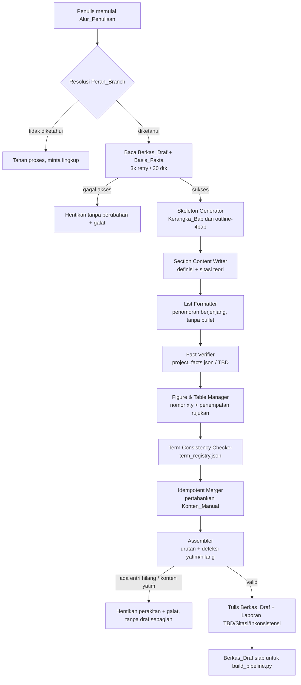

# Design Document

## Overview

Dokumen desain ini menjelaskan rancangan **Alur_Penulisan** — sistem orkestrasi yang menghasilkan dan menyusun konten draf laporan Tugas Akhir "Integrasi Denah Virtual UPNVJ" pada berkas Markdown tunggal `Tugas_Akhir_Draft.md` (Berkas_Draf). Alur ini menyusun kerangka bab, mengisi konten per sub-bab sesuai kaidah akademik, menempatkan dan menomori rujukan Gambar/Tabel, menegakkan konsistensi istilah, memverifikasi fakta terhadap `project_facts.json`, lalu merakit seluruh bagian menjadi satu draf yang koheren dan idempoten.

**Batas ruang lingkup (sangat penting):**

- Alur_Penulisan **hanya menghasilkan/menyunting konten Markdown** pada Berkas_Draf. Ia **bukan** pengganti pipeline format `.docx` (`skills/scripts/build_pipeline.py`) dan **bukan** pengganti skill `docx-ta-proyek`.
- Keluaran Alur_Penulisan adalah masukan bagi pipeline format tersebut. Kontrak keluaran (heading `#`, daftar bernomor berindentasi 3 spasi, blok `[TABLE]`, pipe table, page break `---`, seksi `# DAFTAR PUSTAKA`) harus tetap kompatibel dengan `merge_draft_to_docx.py` yang sudah ada. Alur ini tidak boleh mengubah tahap format.

**Sumber kebenaran yang dihormati:**

1. Aturan penulisan — `.kiro/steering/aturan-penulisan.md` (larangan bullet, hierarki penomoran `1.`→`a.`→`1)`→`a)`, penyebutan Gambar/Tabel di tengah kalimat, definisi + sitasi pada sub-bab teori, konsistensi istilah, penomoran gambar mengikuti reading order).
2. Aturan sitasi — `.kiro/steering/aturan-sitasi.md` (APA in-text `(Nama, Tahun)`/`(Nama et al., Tahun)`, setiap sitasi wajib punya entri di Daftar Pustaka, penanda `[BUTUH SITASI]`).
3. Kerangka bab kanonik — `skills/references/outline-4bab.md` (struktur BAB I–IV beserta sub-bab baku).
4. Basis fakta — `project_facts.json` (sumber kebenaran fakta/angka; bila belum ada gunakan `[TBD: ...]`).
5. Konteks proyek & peran branch — `.kiro/steering/konteks-proyek.md`, `PANDUAN-TIM.md`.

## Architecture

Alur_Penulisan dirancang sebagai pipa transformasi Markdown murni (pure text-in/text-out) yang diapit oleh lapisan I/O bersisi-efek. Pemisahan ini penting: logika inti dapat diuji secara property-based tanpa menyentuh berkas, sedangkan akses berkas (retry, penguncian, galat) diisolasi pada lapisan tipis.



### Prinsip arsitektur

1. **Inti murni, tepi bersisi-efek.** Setiap komponen transformasi menerima state draf (string/model in-memory) dan mengembalikan state baru + daftar temuan (laporan). Hanya `DraftIO` dan `FactStore` yang menyentuh disk.
2. **Idempotensi sebagai default.** Semua transformasi dirancang agar `f(f(x)) == f(x)` pada tingkat struktur, sehingga menjalankan ulang alur aman (Requirement 8).
3. **Anti-mengarang secara struktural.** Nilai fakta hanya boleh berasal dari `FactStore` atau berupa `[TBD: ...]`. Tidak ada jalur kode yang menuliskan angka literal dari sumber lain (Requirement 5).
4. **Gagal aman.** Bila prakondisi tidak terpenuhi (berkas tak terbaca, entri kerangka tanpa konten, konten yatim), alur berhenti tanpa menghasilkan draf sebagian dan mempertahankan isi lama (Requirement 1.5, 7.3, 7.4, 8.5, 10.1).

## Components and Interfaces

Antarmuka dinyatakan sebagai fungsi konseptual (Python-style) untuk memperjelas kontrak input/output. Fungsi bertanda **[murni]** tidak melakukan I/O dan menjadi target utama property-based testing.

### 1. DraftIO (lapisan I/O berkas)

```python
def read_draft(path: str, attempts: int = 3, window_seconds: int = 30) -> str
def write_draft(path: str, content: str) -> None
# Melempar DraftInaccessibleError bila gagal akses setelah retry.
```

- Menangani retry 3x dalam 30 detik (Requirement 10.1). Bila tetap gagal, melempar `DraftInaccessibleError` dan **tidak** menulis apa pun (Requirement 1.5, 8.5, 10.1, 10.2).

### 2. SkeletonGenerator **[murni]**

```python
def generate_skeleton(draft: DraftModel, outline: Outline, scope: BranchScope) -> tuple[DraftModel, list[Finding]]
def title_matches(existing: str, canonical: str) -> bool   # abaikan case & spasi tepi
```

- Menghasilkan Kerangka_Bab BAB I–IV berurutan beserta sub-bab baku dari `outline-4bab.md` (Requirement 1.1) dengan penomoran hierarkis (Requirement 1.2).
- Judul yang sudah ada (cocok mengabaikan case & spasi tepi) dipertahankan; tidak menambah duplikat (Requirement 1.3). Bila kerangka sudah lengkap, tidak menghasilkan ulang (Requirement 1.4).

### 3. SectionContentWriter **[murni]**

```python
def write_theory_subchapter(entry: SkeletonEntry, facts: FactStore, bib: BibliographyResult) -> tuple[ContentBlock, list[Finding]]
def has_cited_definition(paragraph: Paragraph) -> bool
```

- Menempatkan tepat satu paragraf definisi sebagai paragraf pertama Sub_Bab_Teori (Requirement 2.1) dengan minimal satu Sitasi_APA menempel (Requirement 2.2).
- Klaim faktual tanpa sitasi ditandai `[BUTUH SITASI]` tanpa menghapus teks (Requirement 2.3). Bila paragraf pertama tak bersitasi, ditandai `[BUTUH SITASI]` (Requirement 2.4). Sitasi tanpa padanan di Daftar Pustaka ditandai `[BUTUH SITASI]` dan klaim tidak dianggap tervalidasi (Requirement 2.5).

### 4. ListFormatter **[murni]**

```python
def render_list(tree: ListTree) -> list[str]      # baris Markdown berindentasi 3 spasi
def marker_for_level(level: int) -> str            # 1->"1." 2->"a." 3->"1)" 4->"a)"
def clamp_level(level: int) -> int                 # >4 dipatok ke 4
```

- Level 1–4 memakai penanda `1.`, `a.`, `1)`, `a)` (Requirement 3.1); penomoran berurutan +1 per level (Requirement 3.2); sub-level baru di-reset ke penanda awal (Requirement 3.3); kedalaman >4 dipatok pada penanda level 4 `a)` (Requirement 3.4); tidak pernah memakai bullet `-`/`*`/`+` (Requirement 3.5).
- Indentasi keluaran 3 spasi per level agar konsisten dengan `LIST_INDENT_UNIT = 3` pada `merge_draft_to_docx.py`.

### 5. FigureTableManager **[murni]**

```python
def number_objects(draft: DraftModel) -> tuple[DraftModel, list[Finding]]
def is_valid_reference_position(sentence: str, index: int) -> bool
```

- Menomori Gambar/Tabel `x.y`: x = nomor bab, y = urutan kemunculan (reading order) mulai 1 (Requirement 4.2); penghitung y di-reset per bab, terpisah untuk Gambar dan Tabel (Requirement 4.3).
- Rujukan_Objek tidak boleh di awal paragraf maupun tepat setelah tanda akhir kalimat (Requirement 4.1). Rujukan ke objek yang belum bernomor/tidak ada menghasilkan galat dan mempertahankan narasi (Requirement 4.4).

### 6. FactVerifier **[murni + FactStore I/O]**

```python
def resolve_fact(key: str, facts: FactStore) -> FactValue     # nilai persis atau Placeholder_TBD
def emit_value(key: str, facts: FactStore) -> str             # tidak pernah nilai dari sumber lain
```

- Mencari nilai pada Basis_Fakta sebelum menulis (Requirement 5.1); menulis nilai persis tanpa pembulatan/penambahan (Requirement 5.2); menulis `[TBD: ...]` bila tidak tersedia (Requirement 5.3); bila nilai kandidat berbeda dari Basis_Fakta, memakai nilai Basis_Fakta dan menolak lainnya (Requirement 5.4); satu-satunya sumber nilai adalah Basis_Fakta atau `[TBD: ...]` (Requirement 5.5).
- Bila Basis_Fakta tidak dapat diakses setelah retry, seluruh nilai bergantung fakta ditulis `[TBD: ...]` (Requirement 10.3).

### 7. TermConsistencyChecker **[murni]**

```python
def scan_terms(draft: DraftModel, registry: TermRegistry) -> InconsistencyReport
def canonical_form(term: str, registry: TermRegistry) -> str | None
```

- Untuk istilah dengan padanan baku terdaftar: gunakan satu bentuk baku identik di seluruh draf (Requirement 6.1); pemindaian seluruh draf mengabaikan case (Requirement 6.2); dua+ bentuk berbeda untuk konsep sama dilaporkan dengan lokasi kemunculan **tanpa mengubah draf otomatis** (Requirement 6.3).
- Istilah tanpa padanan baku: bentuk kemunculan pertama menjadi acuan dan dipertahankan konsisten (Requirement 6.4).

### 8. IdempotentMerger **[murni]**

```python
def merge(existing: DraftModel, generated: DraftModel) -> tuple[DraftModel, list[Finding]]
def is_manual_content(block: ContentBlock) -> bool
```

- Menjalankan ulang pada kerangka sama menghasilkan struktur identik tanpa duplikasi (Requirement 8.1); mempertahankan seluruh Konten_Manual tanpa menimpa (Requirement 8.2); memperbarui bab yang sudah ada di lokasi sama tanpa menyalin (Requirement 8.3); menambahkan hanya bab/sub-bab baru dan mempertahankan yang ada beserta Konten_Manual (Requirement 8.4).

### 9. Assembler **[murni]**

```python
def assemble(skeleton: Skeleton, contents: dict[EntryId, ContentBlock]) -> tuple[DraftModel, list[Finding]]
# Melempar AssemblyError (entri hilang / konten yatim) tanpa menghasilkan draf sebagian.
```

- Menyusun bab/sub-bab persis mengikuti urutan & kedalaman Kerangka_Bab (Requirement 7.1); keluaran tetap dapat diproses pipeline `.docx` (Requirement 7.2); entri tanpa konten → hentikan + galat, tanpa draf sebagian (Requirement 7.3); konten yatim → hentikan + galat, tanpa draf sebagian (Requirement 7.4); setiap entri muncul tepat satu kali saat sukses (Requirement 7.5).

### 10. BranchScopeResolver **[murni + Git I/O]**

```python
def resolve_scope(active_branch: str | None) -> BranchScope        # None => Undetermined
def in_scope(entry: SkeletonEntry, scope: BranchScope) -> bool
```

- Membatasi cakupan konten pada Peran_Branch aktif `laporan/iman|dwikhi|faiz` (Requirement 9.1); konten dalam lingkup ditulis (Requirement 9.2); permintaan di luar lingkup ditolak dengan indikasi peran yang seharusnya (Requirement 9.3); bila peran tak tentu, tahan pembuatan dan minta lingkup (Requirement 9.4); menampilkan indikasi peran aktif saat mulai (Requirement 9.5).

### 11. ReportBuilder **[murni]**

```python
def build_report(findings: list[Finding]) -> WriterReport
```

- Mengumpulkan seluruh temuan: daftar `[TBD: ...]` beserta penyebab (Requirement 10.5), penanda `[BUTUH SITASI]`, laporan inkonsistensi istilah, dan galat rujukan objek. Menangani bagian wajib kosong dengan `[TBD: ...]` (Requirement 10.4).

## Data Models

```python
from dataclasses import dataclass
from enum import Enum

class Level(Enum):
    BAB = 1
    SUBBAB = 2
    SUBSUBBAB = 3

@dataclass(frozen=True)
class SkeletonEntry:
    entry_id: str          # mis. "2.3.5"
    numbering: str         # penomoran hierarkis tampil ("2.3.5")
    title: str             # judul baku
    level: Level
    owner_role: str        # peran branch yang bertanggung jawab

@dataclass(frozen=True)
class Skeleton:
    entries: tuple[SkeletonEntry, ...]   # urutan = reading order kanonik

class BlockKind(Enum):
    GENERATED = "generated"
    MANUAL = "manual"

@dataclass
class ContentBlock:
    entry_id: str
    paragraphs: list["Paragraph"]
    kind: BlockKind

@dataclass
class Paragraph:
    text: str
    is_definition: bool = False

# Daftar berjenjang
@dataclass
class ListNode:
    text: str
    children: list["ListNode"]

# marker per level: {1:"1.", 2:"a.", 3:"1)", 4:"a)"}, level>4 dipatok ke 4

class ObjectKind(Enum):
    GAMBAR = "Gambar"
    TABEL = "Tabel"

@dataclass(frozen=True)
class NumberedObject:
    kind: ObjectKind
    bab: int
    seq_y: int             # urutan dalam bab (mulai 1), terpisah Gambar/Tabel
    number: str            # "x.y"

@dataclass(frozen=True)
class ObjectReference:
    kind: ObjectKind
    number: str            # "x.y" yang dirujuk
    para_offset: int       # posisi dalam paragraf (untuk aturan penempatan 4.1)

# Basis fakta & TBD
@dataclass(frozen=True)
class FactValue:
    key: str
    present: bool
    value: str | None       # nilai persis dari Basis_Fakta bila present
    tbd_reason: str | None  # deskripsi bila menjadi Placeholder_TBD

# Istilah
@dataclass(frozen=True)
class TermRegistry:
    canonical: dict[str, str]   # bentuk lower -> bentuk baku

@dataclass(frozen=True)
class TermOccurrence:
    form: str
    line: int

@dataclass
class InconsistencyReport:
    concept_key: str
    forms: list[TermOccurrence]

# Peran branch
class ScopeState(Enum):
    RESOLVED = "resolved"
    UNDETERMINED = "undetermined"

@dataclass(frozen=True)
class BranchScope:
    state: ScopeState
    role: str | None            # "iman" | "dwikhi" | "faiz" | None
    owned_entries: frozenset[str]

# Temuan & laporan
class FindingKind(Enum):
    TBD = "tbd"
    MISSING_CITATION = "missing_citation"
    TERM_INCONSISTENCY = "term_inconsistency"
    DANGLING_REFERENCE = "dangling_reference"
    MISSING_ENTRY = "missing_entry"
    ORPHAN_CONTENT = "orphan_content"
    OUT_OF_SCOPE = "out_of_scope"

@dataclass(frozen=True)
class Finding:
    kind: FindingKind
    location: str
    detail: str

@dataclass
class WriterReport:
    findings: list[Finding]
    active_role: str | None
```

**Model draf (DraftModel):** representasi in-memory berorientasi blok — daftar terurut dari heading, paragraf, node daftar, blok kode, `[TABLE]`/pipe table, dan page break — yang me-round-trip ke/dari teks Markdown yang kompatibel dengan `merge_draft_to_docx.py`. Konten_Manual ditandai pada tingkat blok (`BlockKind.MANUAL`) sehingga IdempotentMerger dapat mempertahankannya.

## Correctness Properties

*Sebuah properti adalah karakteristik atau perilaku yang harus selalu benar di seluruh eksekusi valid sistem — pada dasarnya pernyataan formal tentang apa yang seharusnya dilakukan sistem. Properti menjadi jembatan antara spesifikasi yang dapat dibaca manusia dan jaminan kebenaran yang dapat diverifikasi mesin.*

Properti berikut diturunkan dari prework di atas dan telah melalui refleksi untuk menghilangkan redundansi. Setiap properti bersifat universal ("untuk setiap ...") dan menjadi target property-based testing.

### Property 1: Kelengkapan dan urutan Kerangka_Bab

*Untuk setiap* keadaan awal Berkas_Draf (kosong maupun sebagian), hasil pembuatan Kerangka_Bab memuat seluruh entri baku BAB I sampai BAB IV beserta sub-bab bakunya dari outline kanonik, dalam urutan kanonik yang sama, dengan penomoran hierarkis yang sesuai dengan level tiap entri.

**Validates: Requirements 1.1, 1.2**

### Property 2: Tidak ada duplikasi judul kerangka

*Untuk setiap* Berkas_Draf yang sudah memuat sebagian judul baku dalam variasi huruf besar/kecil atau spasi tepi, setelah pembuatan Kerangka_Bab setiap entri baku muncul tepat satu kali (judul yang cocok — mengabaikan case dan spasi tepi — dipertahankan, bukan diduplikasi).

**Validates: Requirements 1.3**

### Property 3: Idempotensi menjalankan ulang alur

*Untuk setiap* Berkas_Draf, menjalankan alur dua kali menghasilkan struktur bab dan sub-bab (judul, urutan, penomoran) yang identik dengan menjalankannya sekali; tidak ada bab atau sub-bab duplikat yang ditambahkan.

**Validates: Requirements 1.4, 8.1**

### Property 4: Paragraf definisi bersitasi pada Sub_Bab_Teori

*Untuk setiap* Sub_Bab_Teori yang disusun, paragraf pertama adalah tepat satu paragraf definisi konsep utama, dan paragraf tersebut memuat paling sedikit satu Sitasi_APA in-text yang menempel — atau, bila tidak, paragraf pertama ditandai dengan Penanda_Sitasi_Kurang.

**Validates: Requirements 2.1, 2.2, 2.4**

### Property 5: Penandaan klaim tanpa sitasi tanpa penghapusan teks

*Untuk setiap* klaim faktual yang bukan pengetahuan umum dan bukan observasi penulis sendiri serta belum memiliki Sitasi_APA, hasilnya menambahkan Penanda_Sitasi_Kurang pada posisi klaim dan mempertahankan seluruh teks klaim tanpa menghapusnya.

**Validates: Requirements 2.3, 2.4**

### Property 6: Sitasi tanpa entri Daftar Pustaka ditandai

*Untuk setiap* Sitasi_APA yang tidak memiliki entri padanan pada Daftar Pustaka, sitasi tersebut ditandai dengan Penanda_Sitasi_Kurang dan klaim terkaitnya tidak diperlakukan sebagai klaim yang sudah tervalidasi.

**Validates: Requirements 2.5**

### Property 7: Kebenaran penomoran Daftar_Berjenjang

*Untuk setiap* pohon daftar berjenjang, keluaran memenuhi seluruh aturan penomoran: item level 1–4 memakai penanda `1.`, `a.`, `1)`, `a)` sesuai level; item bersaudara pada level yang sama bernomor berurutan naik satu langkah mulai dari `1`/`a`; setiap sub-level baru di-reset ke penanda awal; dan item yang lebih dalam dari level 4 tetap memakai penanda level 4 (`a)`).

**Validates: Requirements 3.1, 3.2, 3.3, 3.4**

### Property 8: Tidak ada penanda bullet

*Untuk setiap* daftar yang dituliskan ke Berkas_Draf, tidak ada satu pun item pada level mana pun yang memakai penanda bullet `-`, `*`, atau `+`.

**Validates: Requirements 3.5**

### Property 9: Posisi valid Rujukan_Objek

*Untuk setiap* Rujukan_Objek ("Gambar x.y" / "Tabel x.y") yang dituliskan, frasa rujukan tidak berada di awal paragraf dan tidak tepat setelah tanda akhir kalimat (titik, tanda tanya, atau tanda seru).

**Validates: Requirements 4.1**

### Property 10: Penomoran Gambar dan Tabel mengikuti reading order per bab

*Untuk setiap* Berkas_Draf, nomor setiap Gambar/Tabel berformat `x.y` dengan x adalah nomor bab tempat objek berada dan y adalah urutan kemunculan objek pada bab tersebut (mulai dari 1, bertambah 1 mengikuti reading order); penghitung y di-reset ke 1 pada setiap bab baru dan dihitung terpisah untuk Gambar dan untuk Tabel.

**Validates: Requirements 4.2, 4.3**

### Property 11: Rujukan objek menggantung dilaporkan tanpa menghapus narasi

*Untuk setiap* Rujukan_Objek ke Gambar/Tabel yang belum bernomor atau tidak ada pada Berkas_Draf, hasilnya menghasilkan indikasi kesalahan yang menyebut rujukan tersebut dan mempertahankan narasi tanpa menghapusnya.

**Validates: Requirements 4.4**

### Property 12: Sumber nilai fakta terbatas pada Basis_Fakta atau Placeholder_TBD

*Untuk setiap* permintaan penulisan nilai fakta/angka proyek: bila nilainya tersedia pada Basis_Fakta, nilai yang ditulis sama persis dengan yang tercatat (tanpa pembulatan atau penambahan) dan nilai kandidat lain yang berbeda ditolak; bila tidak tersedia, yang ditulis adalah Placeholder_TBD berisi deskripsi fakta. Tidak ada nilai fakta yang berasal dari sumber selain Basis_Fakta atau Placeholder_TBD.

**Validates: Requirements 5.1, 5.2, 5.3, 5.4, 5.5**

### Property 13: Basis_Fakta tak terakses memaksa Placeholder_TBD

*Untuk setiap* barisan permintaan fakta ketika Basis_Fakta tidak dapat diakses (setelah 3 percobaan dalam 30 detik), setiap nilai yang bergantung pada Basis_Fakta ditulis sebagai Placeholder_TBD.

**Validates: Requirements 10.3**

### Property 14: Konsistensi istilah berpadanan baku

*Untuk setiap* istilah yang memiliki padanan baku terdaftar, seluruh kemunculannya dinormalkan ke satu bentuk baku yang identik di seluruh Berkas_Draf, dengan pencocokan yang mengabaikan perbedaan huruf besar/kecil di seluruh isi draf.

**Validates: Requirements 6.1, 6.2**

### Property 15: Laporan inkonsistensi istilah tanpa mutasi otomatis

*Untuk setiap* Berkas_Draf yang memuat dua atau lebih bentuk berbeda untuk satu konsep yang sama (padanan baku terdaftar sama), laporan yang dihasilkan memuat setiap bentuk yang ditemukan beserta lokasi kemunculannya, dan isi Berkas_Draf tidak diubah secara otomatis (draf keluaran identik dengan draf masukan).

**Validates: Requirements 6.3**

### Property 16: Istilah tanpa padanan baku memakai bentuk kemunculan pertama

*Untuk setiap* istilah yang tidak memiliki padanan baku terdaftar, bentuk pada kemunculan pertama menjadi acuan dan dipertahankan sama pada seluruh kemunculan berikutnya di dalam Berkas_Draf.

**Validates: Requirements 6.4**

### Property 17: Perakitan mempertahankan urutan dan kedalaman Kerangka_Bab

*Untuk setiap* pasangan Kerangka_Bab dan konten lengkap yang valid, draf hasil perakitan menyusun bab dan sub-bab dengan urutan dan tingkat kedalaman yang sama persis seperti urutan entri pada Kerangka_Bab.

**Validates: Requirements 7.1**

### Property 18: Perakitan sukses memunculkan setiap entri tepat satu kali

*Untuk setiap* perakitan yang selesai tanpa kesalahan, setiap entri Kerangka_Bab muncul tepat satu kali di dalam Berkas_Draf hasil.

**Validates: Requirements 7.5**

### Property 19: Entri tanpa konten menghentikan perakitan tanpa draf sebagian

*Untuk setiap* Kerangka_Bab yang memiliki satu atau lebih entri tanpa konten terkait, perakitan berhenti dan menghasilkan indikasi kesalahan yang menyebut setiap entri yang kontennya hilang, tanpa menghasilkan Berkas_Draf sebagian.

**Validates: Requirements 7.3**

### Property 20: Konten yatim menghentikan perakitan tanpa draf sebagian

*Untuk setiap* konten yang tidak memiliki entri padanan pada Kerangka_Bab, perakitan berhenti dan menghasilkan indikasi kesalahan yang menyebut konten yatim tersebut, tanpa menghasilkan Berkas_Draf sebagian.

**Validates: Requirements 7.4**

### Property 21: Konten_Manual dipertahankan utuh

*Untuk setiap* Berkas_Draf yang memuat Konten_Manual, setelah alur diproses setiap blok Konten_Manual tetap ada tanpa ditimpa, dihapus, atau diubah isinya.

**Validates: Requirements 8.2**

### Property 22: Pembaruan bab yang ada tanpa duplikasi lokasi

*Untuk setiap* bab atau sub-bab pada Kerangka_Bab yang sudah ada di Berkas_Draf, isinya diperbarui di lokasi yang sama sehingga bab tersebut muncul tepat satu kali (tanpa membuat salinan bab baru).

**Validates: Requirements 8.3**

### Property 23: Penggabungan kerangka berbeda bersifat union yang mempertahankan konten lama

*Untuk setiap* pasangan struktur draf yang sudah ada dan Kerangka_Bab jalannya saat ini yang berbeda, hasilnya adalah gabungan entri di mana hanya bab/sub-bab yang belum ada yang ditambahkan, sedangkan bab yang sudah ada beserta Konten_Manual-nya dipertahankan.

**Validates: Requirements 8.4**

### Property 24: Cakupan penulisan sesuai Peran_Branch aktif

*Untuk setiap* branch aktif di antara `laporan/iman`, `laporan/dwikhi`, atau `laporan/faiz`, seluruh konten yang dihasilkan dan dituliskan berada dalam lingkup Peran_Branch yang bersangkutan.

**Validates: Requirements 9.1, 9.2**

### Property 25: Permintaan di luar lingkup ditolak dengan indikasi peran

*Untuk setiap* permintaan konten yang berada di luar lingkup Peran_Branch aktif, alur menolak menghasilkan konten tersebut dan menghasilkan indikasi yang menyebut Peran_Branch yang seharusnya menangani konten itu.

**Validates: Requirements 9.3**

### Property 26: Bagian wajib kosong diberi Placeholder_TBD

*Untuk setiap* bagian wajib yang kosong pada Berkas_Draf yang dapat diakses, alur menuliskan Placeholder_TBD pada bagian wajib tersebut.

**Validates: Requirements 10.4**

### Property 27: Setiap Placeholder_TBD dilaporkan beserta penyebabnya

*Untuk setiap* Placeholder_TBD yang dituliskan alur, laporan kepada penulis memuat entri bagian tersebut beserta penyebabnya (jumlah entri laporan TBD sama dengan jumlah Placeholder_TBD pada draf).

**Validates: Requirements 10.5**

## Error Handling

Penanganan galat dikelompokkan menjadi galat I/O (bersisi-efek) dan galat validasi (murni). Prinsip menyeluruh: **gagal aman tanpa draf sebagian** dan **pertahankan isi lama**.

### Galat akses berkas (Berkas_Draf)

- `DraftIO.read_draft`/`write_draft` mencoba akses hingga 3 kali dalam jendela 30 detik (Requirement 10.1). Bila tetap gagal, melempar `DraftInaccessibleError` **sebelum** ada penulisan apa pun.
- Alur menangkap error ini, menghentikan proses, mempertahankan seluruh isi Berkas_Draf tanpa perubahan, dan menampilkan pesan galat yang menyebut penyebab kegagalan akses beserta nama Berkas_Draf (Requirement 1.5, 8.5, 10.1, 10.2).

### Galat akses Basis_Fakta

- Bila `FactStore` tidak dapat diakses setelah 3 percobaan dalam 30 detik, `FactVerifier` tidak menggagalkan seluruh alur; sebaliknya setiap nilai bergantung fakta diturunkan menjadi `[TBD: ...]` (Requirement 10.3) dan dicatat sebagai `Finding(TBD)` dengan penyebab "Basis_Fakta tidak dapat diakses".

### Galat validasi perakitan

- `Assembler.assemble` melakukan dua pemeriksaan sebelum menghasilkan output:
  1. Setiap entri Kerangka_Bab memiliki konten → jika tidak, `AssemblyError` menyebut daftar entri yang kontennya hilang (Requirement 7.3).
  2. Setiap konten memiliki entri padanan → jika tidak, `AssemblyError` menyebut konten yatim (Requirement 7.4).
- Pada kedua kasus, **tidak ada Berkas_Draf sebagian** yang ditulis; state lama dipertahankan.

### Galat lingkup peran

- Bila Peran_Branch tak dapat ditentukan (`ScopeState.UNDETERMINED`), alur menahan pembuatan konten dan meminta penulis menentukan lingkup terlebih dahulu (Requirement 9.4).
- Permintaan di luar lingkup menghasilkan `Finding(OUT_OF_SCOPE)` yang menyebut peran pemilik, bukan penulisan konten (Requirement 9.3).

### Temuan non-fatal (dilaporkan, alur tetap lanjut)

Temuan berikut tidak menghentikan alur tetapi dikumpulkan pada `WriterReport`: `[BUTUH SITASI]` (Requirement 2.3–2.5), `[TBD: ...]` (Requirement 5.3, 10.3–10.5), inkonsistensi istilah (Requirement 6.3), dan rujukan objek menggantung (Requirement 4.4). Konsisten dengan pola guard non-fatal pada `validate_docx_structure.py`.

## Testing Strategy

Pendekatan pengujian bersifat ganda: **property-based tests** untuk properti universal dan **unit/integration tests** untuk contoh spesifik, kondisi galat, dan kompatibilitas pipeline.

### Pustaka dan konfigurasi

- Bahasa target Python (selaras dengan `skills/scripts/`), menggunakan pustaka property-based testing **Hypothesis** (repositori sudah memakai `.hypothesis/`). Tidak mengimplementasikan PBT dari nol.
- Setiap property test dijalankan minimal **100 iterasi** (mis. `@settings(max_examples=100)`).
- Setiap property test diberi komentar penanda yang merujuk properti desain, dengan format:
  `# Feature: automated-writing-workflow, Property {number}: {property_text}`
- Setiap correctness property (Property 1–27) diimplementasikan oleh **satu** property test.

### Generator (strategi Hypothesis)

- **DraftModel**: strategi komposit yang membangkitkan urutan blok acak (heading berbagai level, paragraf, node daftar berkedalaman >4, blok `[TABLE]`/pipe table, page break) — termasuk edge case: draf kosong, judul dengan variasi case/spasi (Property 2), daftar berkedalaman >4 (Property 7), karakter non-ASCII.
- **Skeleton + contents**: pasangan valid (semua entri berkonten), serta varian tak-valid (entri tanpa konten, konten yatim) untuk Property 19/20.
- **FactStore**: dict acak key→nilai string; kasus key hadir/absen serta kandidat berbeda untuk Property 12; kasus store tak-tersedia untuk Property 13.
- **TermRegistry + draf**: istilah dengan/ tanpa padanan baku dalam variasi case untuk Property 14–16.
- **BranchScope**: pilihan acak dari tiga peran plus `UNDETERMINED` untuk Property 24/25.

### Unit tests (contoh & edge/error)

- Galat akses Berkas_Draf: berkas terkunci → tidak ada penulisan + `DraftInaccessibleError` dengan nama berkas (Requirement 1.5, 8.5, 10.1, 10.2).
- Perilaku "cari sebelum tulis" fakta via mock/spy (Requirement 5.1).
- Peran tak tentu → menahan pembuatan (Requirement 9.4); indikasi peran aktif pada laporan (Requirement 9.5).

### Integration tests (kompatibilitas pipeline, bukan PBT)

- Requirement 7.2 diuji sebagai integrasi: jalankan `merge_draft_to_docx.parse_markdown` pada beberapa (1–3) draf hasil alur dan verifikasi parsing berhasil tanpa error serta struktur item terparse sesuai harapan. Ini **tidak** menjalankan `build_pipeline.py` penuh maupun memodifikasi tahap format.
- Verifikasi indentasi daftar keluaran = 3 spasi/level agar `compute_list_level` menghasilkan level yang sama dengan struktur logis.

### Catatan cakupan

Kriteria yang tidak dapat diuji sebagai properti (galat I/O murni, indikasi UI/laporan tekstual) ditangani oleh unit/integration test sebagaimana di atas. Seluruh kriteria yang bersifat logika transformasi Markdown murni tercakup oleh Property 1–27.
