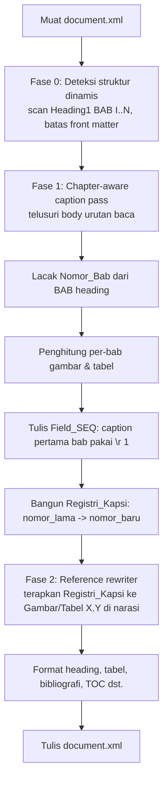
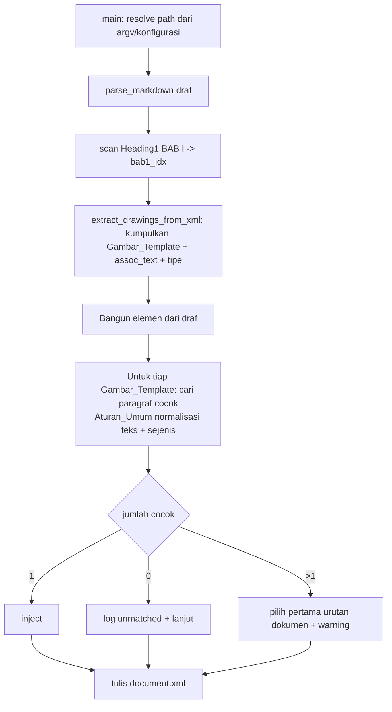

# Dokumen Desain

## Overview

Desain ini menjadikan tahap **GENERASI** pipeline penyusunan Tugas Akhir sepenuhnya dinamis
terhadap isi `Tugas_Akhir_Draft.md`, dengan menghapus seluruh pengkodean nilai tetap (hardcoding)
yang terikat pada draf saat ini di dalam dua skrip:

- **Mesin_Format** — `skills/scripts/format_ta_proyek.py`
- **Mesin_Merge** — `scratch/merge_draft_to_docx.py`

Sasaran utama adalah agar penomoran kapsi, deskripsi kapsi, asosiasi gambar template, deteksi
seksi/heading, renumbering referensi silang, dan konfigurasi path **diturunkan dari struktur
dokumen yang sedang diproses**, bukan dari tabel/daftar/indeks literal. Guard validasi
(`scratch/validate_docx_structure.py`) dan mekanisme injeksi gambar berbasis `images/manifest.json`
**tidak diubah secara semantik** (Requirement 9).

Prinsip desain:

1. **Satu kali jalan sadar-bab (single chapter-aware pass).** Mesin_Format menelusuri body dalam
   urutan baca dokumen sekali, melacak `Nomor_Bab` dari heading `Heading1` (BAB) pembungkus, dan
   memberi nomor kapsi gambar/tabel per-bab dengan penghitung per-bab yang me-reset di tiap bab.
2. **Sumber kebenaran tunggal untuk nomor.** Pass tersebut membangun *registri kapsi* (peta nomor
   lama → nomor baru). Renumbering referensi silang **diturunkan dari registri itu**, bukan dari
   tabel `ref_repl()` statis.
3. **Aturan_Umum, bukan kasus khusus bernama.** Deskripsi kapsi diambil dari draf; asosiasi gambar
   template memakai pencocokan teks ternormalisasi; deteksi seksi memakai pemindaian gaya+teks.
4. **Perubahan minimal & terlokalisasi.** Semua perubahan berada di dalam dua skrip generasi;
   tidak ada perubahan pada validator, injeksi gambar pasca-COM, atau struktur halaman depan
   selain penggantian kopling literal dengan Aturan_Umum.

### Pemetaan hardcoding → solusi

| Hardcoding pada kode saat ini | Lokasi | Solusi dinamis | Requirement |
|---|---|---|---|
| `ref_repl()` tabel pemetaan tetap "Gambar 2.x" | `format_ta_proyek.py` ~1036 | Pemetaan diturunkan dari registri kapsi | R6 |
| `survey_captions` (7 teks literal) + pemicu "Analisis Sistem yang Sedang Berjalan" / "Integrasi Backend dengan Unity" | ~1077, ~1272, ~1283 | Deskripsi dari draf; gambar tanpa kapsi → Aturan_Umum | R3 |
| Penomoran BAB II `gambar_idx` sekuensial paksa "2." | ~1472 | Penghitung per-bab seragam untuk semua bab | R1, R2 |
| `bab1_idx_orig = 60`, `section1_last_p_idx = 60` | ~1100, ~1383 | Pemindaian heading dengan fallback struktural | R5 |
| `is_match()` trik image20→"modaltambahdatagedung", "Dosen"→"Gedung" | `merge_draft_to_docx.py` ~520 | Pencocokan teks ternormalisasi + sejenis | R4 |
| Path absolut di `main()` | `merge_draft_to_docx.py` ~660 | argv/konfigurasi relatif terhadap akar ruang kerja | R7 |

## Architecture

### Aliran Mesin_Format (`format_document_xmls`)

Saat ini `format_document_xmls()` melakukan beberapa hal bercampur: renumbering referensi
(`ref_repl`), pembuatan kapsi survei literal, lalu pass penomoran kapsi (`gambar_idx` /
`gambar_seq_by_chap`). Desain baru menata ulang menjadi tiga fase eksplisit yang berurutan namun
tetap di dalam fungsi yang sama (perubahan minimal):



Perbedaan kunci dari kode lama:

- **Fase 1 menggantikan dua cabang `if src_chap >= 3 ... else (BAB II)`** dengan satu logika
  per-bab seragam. `Nomor_Bab` tidak lagi diparse dari nomor sumber kapsi (yang bisa acak/placeholder)
  melainkan dari **BAB heading pembungkus** dalam urutan baca. Penghitung per-bab
  (`per_chapter_fig_seq[bab]`, `per_chapter_tbl_seq[bab]`) menggantikan `gambar_idx` global dan
  `gambar_seq_by_chap` parsial.
- **Fase 2 menggantikan `ref_repl()`.** Karena Fase 1 sudah tahu setiap kapsi "nomor lama → nomor
  baru", peta itu dipakai langsung untuk menulis ulang referensi silang. Tidak ada lagi tabel
  angka statis.
- **Fase 0 menggantikan konstanta 60.** Batas front matter, `section1_last_p_idx`, dan posisi
  seksi lain ditemukan via pemindaian gaya+teks dengan fallback struktural.
- **Pembuatan kapsi survei literal dihapus.** Gambar tanpa kapsi di draf ditangani satu Aturan_Umum
  (lihat R3 di Components).

### Aliran Mesin_Merge (`merge_draft_to_xml`)



Perbedaan kunci: `is_match()` tidak lagi memuat cabang `target_img`/"image20"/"modaltambahdatagedung".
Logika seleksi dipindahkan dari "pertama yang cocok lalu `break`" menjadi "kumpulkan semua kandidat
cocok lalu terapkan kebijakan tie-break + logging" agar memenuhi R4.3–R4.5.

### Modul kecil baru (helper murni)

Untuk menjaga keterujian (PBT), logika inti diekstrak ke fungsi murni tanpa efek samping XML
sehingga dapat diuji langsung:

- `parse_chapter_number(text) -> int | None` (R1.1, R5)
- `ChapterCaptionNumberer` / registri kapsi (R1, R2, R6)
- `normalize_assoc_text(text) -> str` dan `find_matches(...)` (R4)
- `derive_reference_remap(registry) -> dict` dan `rewrite_reference(text, remap) -> (text, warnings)` (R6)
- `resolve_path(path, workspace_root)` dan pembacaan konfigurasi (R7)

## Components and Interfaces

### 1. Pelacak bab & parser Nomor_Bab (R1, R2, R5)

```python
ROMAN = {"I":1,"II":2,"III":3,"IV":4,"V":5,"VI":6,"VII":7,"VIII":8,"IX":9,"X":10}

def parse_chapter_number(heading_text: str) -> int | None:
    """Ambil Nomor_Bab dari teks heading BAB.
    Mendukung 'BAB II', 'BAB 2', 'BAB II RANCANGAN PROYEK', case-insensitive,
    spasi ternormalisasi. Mengembalikan None bila bukan heading BAB.
    Aturan: cocokkan ^BAB\\s+([IVX]+|[0-9]+)\\b; angka romawi -> ROMAN, arab -> int().
    """
```

Pelacak bab adalah variabel berjalan `current_chapter: int` yang diperbarui setiap kali pass
menemui paragraf `Heading1` yang `parse_chapter_number()`-nya bukan `None`. Nilai ini menjadi
`Nomor_Bab` untuk semua kapsi setelahnya sampai BAB berikutnya (urutan baca dokumen, R1.1/R2.1).

### 2. Registri penomoran kapsi (R1, R2, R6)

```python
class CaptionRegistry:
    """Menomori kapsi gambar & tabel per-bab dan merekam pemetaan nomor lama->baru."""
    def __init__(self):
        self._fig_seq: dict[int, int] = {}   # bab -> seq gambar berjalan
        self._tbl_seq: dict[int, int] = {}   # bab -> seq tabel berjalan
        self.fig_remap: dict[str, str] = {}  # "2.5" -> "2.7"  (kunci & nilai "C.k")
        self.tbl_remap: dict[str, str] = {}
        self.fig_numbers: set[str] = set()   # himpunan nomor gambar final
        self.tbl_numbers: set[str] = set()

    def next_figure(self, chapter: int, old_number: str | None) -> tuple[str, int, bool]:
        """Kembalikan (nomor_baru 'C.k', default_val=k, is_first_in_chapter).
        is_first_in_chapter True => Field_SEQ pakai opsi restart \\r 1 (R1.4),
        selain itu tanpa restart (R1.5). default_val=k juga dipakai sebagai teks
        default field. Sekaligus mencatat old_number->nomor_baru ke fig_remap."""
    def next_table(self, chapter: int, old_number: str | None) -> tuple[str, int, bool]:
        """Analog untuk tabel (R2.2–R2.4)."""
```

Catatan implementasi terhadap kode lama:

- `format_caption_paragraph_clean(p, label, prefix, seq_name, default_val, desc, ns)` **tetap
  dipakai apa adanya**. Kontrak `default_val == 1` → `SEQ ... \r 1` sudah benar (Requirement 1.4/2.3),
  jadi kita cukup memanggilnya dengan `prefix=f"{chapter}."` dan `default_val=k` dari registri.
  Karena `k` selalu 1 untuk kapsi pertama tiap bab, opsi `\r 1` otomatis muncul tepat di kapsi
  pertama bab dan tidak pada kapsi lain — persis perilaku yang diminta R1.4/R1.5 & R2.3/R2.4.
- `seq_name` dipertahankan stabil per-jenis ("Gambar" / "Tabel") agar `SEQ` Word konsisten.

`next_figure`/`next_table` menjadi **satu-satunya** sumber penomoran untuk SEMUA bab (R1.6/R2.5),
menggantikan cabang `if src_chap >= 3 ... else` dan penghitung `gambar_idx` paksa "2." (R1, R2).

`old_number` adalah nomor "C.Y" yang terbaca dari teks kapsi sumber draf (jika ada). Pasangan
`old_number -> nomor_baru` direkam ke `fig_remap`/`tbl_remap` untuk dipakai Fase 2 (R6.3).

### 3. Penyusun deskripsi kapsi dari draf (R3)

Aturan_Umum (tanpa daftar literal, tanpa pemicu judul-seksi bernama):

```
Untuk setiap paragraf body pada Section 2 (isi) dalam urutan baca:
  jika paragraf adalah Kapsi (pStyle 'Caption' ATAU teks diawali 'Gambar '/'Tabel '):
      m = regex "^(Gambar|Tabel)\s+([0-9]+(?:\.[0-9]+)*)\.?\s*(.*)$"
      old_number = m.group(2)            # mis. "2.5"
      desc       = m.group(3).strip()    # Deskripsi_Kapsi VERBATIM dari draf (R3.1)
      chapter    = current_chapter        # dari pelacak bab (BUKAN dari old_number)
      (new_num, k, _) = registry.next_*(chapter, old_number)
      format_caption_paragraph_clean(..., prefix=f"{chapter}.", default_val=k, desc=desc)
  jika paragraf memuat drawing TANPA kapsi mengikutinya:
      -> Aturan_Umum: biarkan apa adanya; JANGAN buat Kapsi, JANGAN beri nomor (R3.3)
```

Deskripsi disalin verbatim dari `desc` draf (R3.1, R3.5). Tidak ada `survey_captions`, tidak ada
cek `"Analisis Sistem yang Sedang Berjalan"` atau `"Integrasi Backend dengan Unity"` (R3.2, R3.4).
Konsekuensi: gambar survei yang dulu diberi kapsi otomatis sekarang **hanya** memperoleh kapsi bila
draf memang menuliskan baris kapsinya; jika tidak, gambar diperlakukan sebagai gambar tanpa kapsi.

### 4. Asosiasi Gambar_Template berbasis Aturan_Umum (R4) — Mesin_Merge

```python
def normalize_assoc_text(t: str) -> str:
    """lowercase, buang prefix 'gambar|tabel|lampiran <num>', buang karakter
    non-alfanumerik, ringkas spasi. (R4.1 normalisasi spasi & huruf besar/kecil)"""

def is_caption_text(t: str) -> bool:
    s = t.strip().lower()
    return s.startswith("gambar") or s.startswith("tabel")

def find_template_matches(assoc_text, candidates):
    """candidates: list[(doc_order_idx, paragraph_text)] dalam urutan dokumen.
    Kembalikan list idx yang cocok menurut Aturan_Umum:
      - sejenis: is_caption_text(assoc) == is_caption_text(p)        (R4.5)
      - cocok ketika normalize(p) memuat normalize(assoc) (substring) (R4.1)
    Tanpa kasus khusus nama berkas/istilah.                          (R4.2)"""
```

Kebijakan seleksi pada `merge_draft_to_xml`:

- **0 cocok (R4.3):** lanjut tanpa berhenti, `log` "Gambar_Template tidak terpasang" beserta
  `assoc_text` dan `target_img`.
- **>1 cocok (R4.4):** pilih indeks terkecil (pertama menurut urutan dokumen), catat `warning`
  "kecocokan ganda" beserta daftar kandidat.
- **1 cocok:** inject seperti biasa.

Penjagaan yang sudah ada dan dipertahankan (bukan kasus khusus bernama, melainkan Aturan_Umum
struktural): penolakan paragraf sangat pendek (`< 15` char) dan penolakan teks mirip-kode
(`code_patterns`). Yang **dihapus** hanya blok `target_img`/"image20…"/"Dosen→Gedung".

### 5. Deteksi seksi & heading dinamis (R5)

```python
def find_front_matter_boundary(children, ns) -> int:
    """Indeks paragraf Heading1 BAB I pertama (teks memuat 'PENDAHULUAN' atau 'BAB I').
    Fallback (R5.3/R5.5): bila tak ada, kembalikan akhir front matter terdeteksi
    (mis. setelah heading front-matter terakhir), dan catat 1 peringatan."""

def find_heading(children, ns, *, style=None, text_contains=None) -> int:
    """Pemindaian awal->akhir; cocokkan pStyle (opsional) dan teks
    case-insensitive + trim. Kembalikan -1 bila tak ada."""
```

Mengganti seluruh konstanta `60`:

- `bab1_idx_orig` → `find_front_matter_boundary(...)` (R5.2).
- `section1_last_p_idx` → `bab1_idx - 1`, dengan `bab1_idx` dari `find_front_matter_boundary`;
  fallback bila tak ada BAB I: akhir front matter terdeteksi (R5.3/R5.5), bukan `60`.

### 6. Reference rewriter dari registri (R6)

```python
def rewrite_references(text: str, fig_remap: dict, tbl_remap: dict) -> tuple[str, list[str]]:
    """Tulis ulang semua 'Gambar X.Y' / 'Tabel X.Y' pada narasi memakai peta
    yang DITURUNKAN dari CaptionRegistry (R6.2, R6.3). Untuk tiap kemunculan:
      - jika old ada di peta unik  -> ganti ke nomor baru (R6.1, termasuk berulang)
      - jika old tak punya padanan -> biarkan + warning (R6.4)
      - jika old ambigu (>1 target)-> biarkan + warning daftar kandidat (R6.5)
    Kembalikan (teks_baru, daftar_peringatan)."""
```

Diterapkan menggantikan `ref_repl()` dan stub `replace_mentions_in_paragraph()`. Karena peta
berasal dari hasil penomoran dokumen yang sedang diproses, tidak ada tabel angka statis (R6.2).

Deteksi ambiguitas: bila lebih dari satu kapsi sumber berbagi `old_number` yang sama (mis. dua
"Gambar 2.5" akibat penyuntingan), `fig_remap` menandai kunci itu sebagai ambigu (nilai khusus
berisi himpunan kandidat) sehingga `rewrite_references` mempertahankan teks asli + warning (R6.5).

### 7. Konfigurasi path (R7) — Mesin_Merge `main()`

```python
def resolve_path(p: str, workspace_root: Path) -> Path:
    return (Path(p) if Path(p).is_absolute() else workspace_root / p)

def main(argv=None):
    # Prioritas: argv > berkas konfigurasi > default relatif
    # argv: merge_draft_to_docx.py [draft_md] [document_xml]
    workspace_root = Path(__file__).resolve().parents[1]   # akar repo
    draft = resolve_path(args.draft or cfg.draft or "Tugas_Akhir_Draft.md", workspace_root)
    xml   = resolve_path(args.xml   or cfg.xml   or "unpacked_ta/word/document.xml", workspace_root)
    # Validasi pra-tulis (R7.4/R7.5): draft wajib terbaca; direktori xml wajib ada.
```

Tidak ada path absolut `d:/Iman/...` lagi (R7.1, R7.2). Path relatif di-*resolve* terhadap akar
ruang kerja (R7.3). Bila draf hilang/tak terbaca atau direktori keluaran tak ada, proses berhenti
sebelum menulis apa pun, dengan pesan menyebut path bermasalah (R7.4, R7.5).

## Data Models

### Registri kapsi (sumber kebenaran tunggal)

```python
# Penghitung per-bab (R1.2/R1.3, R2.2)
per_chapter_fig_seq: dict[int, int]   # {2: 7, 3: 4}  -> bab 2 punya 7 gambar, bab 3 punya 4
per_chapter_tbl_seq: dict[int, int]   # {1: 2, 2: 5, 3: 1}

# Pemetaan renumbering (R6.3) — kunci & nilai berformat "C.Y"
fig_remap: dict[str, str | AMBIGUOUS]   # {"2.1": "2.1", "2.x": "2.15", "2.22": "2.8", ...}
tbl_remap: dict[str, str | AMBIGUOUS]

# Himpunan nomor final untuk pengecekan "punya padanan?" (R6.4)
fig_numbers: set[str]                   # {"2.1","2.2",...,"3.1",...}
tbl_numbers: set[str]
```

Catatan: `AMBIGUOUS` adalah penanda (mis. `frozenset` kandidat) untuk old_number yang memetakan ke
>1 nomor baru (R6.5).

### Caption record (untuk DAFTAR GAMBAR/TABEL, sudah ada `collected_captions`)

```python
{ "type": "Gambar"|"Tabel", "text": "Gambar 2.7 <desc>", "page": <int> }
```

Struktur ini tidak berubah; hanya sumber `text`/`number`-nya kini dari registri dinamis.

### Template drawing entry (Mesin_Merge, sudah ada `drawings_map`)

```python
{ idx: { "p_elem": <Element>, "assoc_text": str, "target_img": str,
         "is_caption": bool } }   # 'is_caption' ditambahkan untuk pencocokan sejenis (R4.5)
```

### Konfigurasi path (R7)

```python
{ "draft": "Tugas_Akhir_Draft.md",
  "xml":   "unpacked_ta/word/document.xml" }   # relatif terhadap akar ruang kerja
```

## Correctness Properties

*Sebuah properti adalah karakteristik atau perilaku yang harus selalu benar untuk seluruh eksekusi
valid sistem — pada dasarnya pernyataan formal tentang apa yang seharusnya dilakukan sistem.
Properti menjadi jembatan antara spesifikasi yang dapat dibaca manusia dan jaminan kebenaran yang
dapat diverifikasi mesin.*

Properti berikut adalah hasil refleksi atas prework (acceptance criteria yang redundan telah
digabung). Setiap properti diuji dengan property-based testing (Hypothesis), minimum 100 iterasi.
Logika diuji pada fungsi murni (`parse_chapter_number`, `CaptionRegistry`, `normalize_assoc_text`,
`find_template_matches`, `find_front_matter_boundary`, `rewrite_references`, `resolve_path`) yang
disuplai elemen/dokumen XML sintetis, sehingga 100+ iterasi murah dijalankan.

### Property 1: Penetapan Nomor_Bab dari BAB pembungkus

*Untuk setiap* susunan dokumen (urutan arbitrer heading BAB dan kapsi gambar/tabel dalam urutan
baca), setiap kapsi memperoleh `Nomor_Bab` sama dengan nomor bab heading BAB terakhir yang muncul
sebelum kapsi tersebut.

**Validates: Requirements 1.1, 2.1**

### Property 2: Penomoran per-bab berurutan untuk gambar dan tabel

*Untuk setiap* dokumen dengan himpunan bab arbitrer (boleh melompat, mis. {1, 2, 5}) dan jumlah
gambar/tabel arbitrer per bab, kapsi ke-`k` (menurut urutan baca dalam bab `C`) dinomori `C.k`
dengan `k` dimulai dari 1 pada elemen pertama bab dan bertambah tepat 1 untuk tiap elemen
berikutnya dalam bab yang sama; aturan ini berlaku identik untuk SEMUA bab dan untuk kedua jenis
(Gambar dan Tabel) tanpa mengasumsikan nomor bab tertentu.

**Validates: Requirements 1.2, 1.3, 1.6, 2.2, 2.5**

### Property 3: Opsi restart SEQ muncul tepat pada kapsi pertama tiap bab

*Untuk setiap* dokumen, sebuah kapsi memuat `Field_SEQ` dengan opsi restart `\r 1` jika dan hanya
jika kapsi tersebut adalah kapsi pertama (menurut jenisnya) dalam babnya; kapsi lain memuat
`Field_SEQ` tanpa opsi restart. Berlaku untuk gambar maupun tabel.

**Validates: Requirements 1.4, 1.5, 2.3, 2.4**

### Property 4: Fallback Nomor_Bab tanpa berhenti

*Untuk setiap* kapsi yang tidak memiliki BAB pembungkus yang dapat ditentukan (mis. muncul sebelum
heading BAB pertama), penomoran memakai `Nomor_Bab` terakhir yang berhasil ditentukan atau 1 bila
belum ada, proses berlanjut tanpa exception, dan tepat satu peringatan yang menyebutkan kapsi
terkait dicatat.

**Validates: Requirements 1.7, 2.6**

### Property 5: Deskripsi kapsi verbatim dari draf

*Untuk setiap* teks Deskripsi_Kapsi arbitrer pada draf (termasuk karakter unicode dan tanda baca),
teks Kapsi yang dihasilkan memuat Deskripsi_Kapsi tersebut secara verbatim, dengan satu-satunya
tambahan berupa label dan nomor; mengubah deskripsi di draf mengubah keluaran secara berpadanan
tanpa perubahan kode.

**Validates: Requirements 3.1, 3.5**

### Property 6: Gambar tanpa kapsi tidak memperoleh kapsi maupun nomor

*Untuk setiap* dokumen yang memuat campuran gambar berkapsi dan gambar tanpa kapsi, jumlah Kapsi
gambar pada keluaran sama dengan jumlah baris kapsi gambar pada draf; tidak ada Kapsi atau nomor
kapsi yang dibuat untuk gambar tanpa kapsi.

**Validates: Requirements 3.3**

### Property 7: Tidak ada teks kapsi yang tidak bersumber dari draf

*Untuk setiap* draf yang tidak memuat suatu teks deskripsi tertentu, keluaran tidak memuat teks
deskripsi tersebut; tidak ada Deskripsi_Kapsi yang disuntikkan dari daftar literal atau dipicu oleh
judul-seksi bernama dalam kode.

**Validates: Requirements 3.2, 3.4**

### Property 8: Pencocokan asosiasi invarian terhadap kapitalisasi, spasi, dan nama berkas

*Untuk setiap* pasangan teks asosiasi dan teks paragraf, keputusan pencocokan Mesin_Merge tidak
berubah ketika kapitalisasi atau spasi salah satu teks diubah (normalisasi), dan tidak berubah
ketika nama berkas gambar target (`target_img`) diganti dengan nilai arbitrer.

**Validates: Requirements 4.1, 4.2**

### Property 9: Pencocokan hanya antar paragraf sejenis

*Untuk setiap* pasangan teks asosiasi dan paragraf yang berbeda jenis (satu kapsi, satu narasi),
Mesin_Merge tidak pernah mencocokkannya.

**Validates: Requirements 4.5**

### Property 10: Tie-break kecocokan ganda memilih urutan dokumen pertama

*Untuk setiap* Gambar_Template dengan lebih dari satu paragraf kandidat yang cocok pada indeks
arbitrer, paragraf terpilih adalah yang berindeks terkecil (pertama menurut urutan dokumen) dan
satu peringatan kecocokan ganda dicatat.

**Validates: Requirements 4.4**

### Property 11: Deteksi heading/seksi invarian terhadap kapitalisasi dan spasi

*Untuk setiap* dokumen dengan heading target yang ditempatkan pada indeks arbitrer, posisi heading
dan batas front matter (heading BAB I pertama) yang terdeteksi tidak bergantung pada nilai indeks
tetap mana pun dan tidak berubah ketika kapitalisasi atau spasi teks heading diubah.

**Validates: Requirements 5.1, 5.2, 5.4**

### Property 12: Fallback deteksi seksi terstruktur

*Untuk setiap* dokumen yang tidak memuat target pencarian (termasuk dokumen tanpa heading BAB I),
deteksi mengembalikan fallback yang diturunkan dari struktur dokumen (heading terdeteksi terdekat
sebelumnya atau akhir front matter), proses berlanjut tanpa exception, dan tepat satu peringatan
yang menyebutkan target pencarian dicatat.

**Validates: Requirements 5.3, 5.5**

### Property 13: Renumbering referensi konsisten dengan kapsi yang ada

*Untuk setiap* dokumen dan narasi arbitrer yang memuat penyebutan "Gambar X.Y"/"Tabel X.Y"
(termasuk kemunculan berulang nomor lama yang sama), setelah renumbering: setiap penyebutan yang
nomor lamanya memiliki padanan unik pada registri kapsi diganti ke nomor baru pada SEMUA
kemunculannya, dan setiap penyebutan hasil renumbering menunjuk ke nomor kapsi yang benar-benar ada
pada dokumen; pemetaan diturunkan dari registri kapsi dokumen, bukan tabel tetap.

**Validates: Requirements 6.1, 6.3**

### Property 14: Referensi tak berpadanan dipertahankan dengan peringatan

*Untuk setiap* penyebutan referensi silang yang nomor lamanya tidak memiliki Kapsi padanan pada
dokumen, teks asli dipertahankan tanpa perubahan dan satu peringatan yang menyebutkan teks
referensi serta nomor tak berpadanan dicatat.

**Validates: Requirements 6.4**

### Property 15: Referensi ambigu dipertahankan dengan peringatan kandidat

*Untuk setiap* penyebutan referensi silang yang nomor lamanya dapat dipetakan ke lebih dari satu
nomor kapsi baru, teks asli dipertahankan tanpa perubahan dan satu peringatan yang menyebutkan teks
referensi serta seluruh nomor baru kandidat dicatat.

**Validates: Requirements 6.5**

### Property 16: Resolusi path relatif terhadap akar ruang kerja

*Untuk setiap* string path, `resolve_path` mengembalikan path apa adanya bila absolut, dan
`workspace_root / path` bila relatif; sehingga tidak ada path absolut tetap yang dipakai dan path
relatif selalu di-resolve terhadap akar ruang kerja.

**Validates: Requirements 7.2, 7.3**

### Property 17: Nomor kapsi draf saat ini identik dengan Dokumen_Referensi

*Untuk setiap* nomor kapsi (Gambar/Tabel) yang tercatat pada Dokumen_Referensi, dokumen keluaran
dari draf saat ini memuat nomor kapsi yang identik (himpunan nomor kapsi keluaran sama dengan
himpunan nomor kapsi referensi).

**Validates: Requirements 8.4**

## Error Handling

Seluruh penanganan kesalahan mengikuti prinsip "lanjut + peringatan" untuk kasus non-fatal pada
tahap penyusunan dokumen, dan "berhenti sebelum menulis keluaran" untuk kesalahan path masukan.

| Kondisi | Penanganan | Requirement |
|---|---|---|
| Kapsi tanpa BAB pembungkus | Pakai `Nomor_Bab` terakhir / 1; lanjut; `print` peringatan menyebut kapsi | R1.7, R2.6 |
| Heading/seksi target tak ditemukan | Fallback struktural (heading terdekat sebelumnya / akhir front matter); lanjut; 1 peringatan | R5.3, R5.5 |
| Tidak ada BAB I sama sekali | Fallback batas front matter terstruktur; lanjut; peringatan | R5.5 |
| Gambar_Template tanpa paragraf cocok | Lanjut; log `assoc_text` + `target_img` tak terpasang | R4.3 |
| Gambar_Template dengan >1 paragraf cocok | Pilih indeks terkecil; warning daftar kandidat | R4.4 |
| Referensi silang tanpa padanan | Pertahankan teks asli; warning teks + nomor tak berpadanan | R6.4 |
| Referensi silang ambigu | Pertahankan teks asli; warning teks + semua kandidat | R6.5 |
| Path draf wajib hilang/tak terbaca | **Berhenti sebelum menulis keluaran**; pesan menyebut path; tidak menimpa berkas | R7.4 |
| Direktori path keluaran tidak ada | **Berhenti**; pesan menyebut path keluaran; tidak menimpa berkas | R7.5 |
| Validator menghasilkan kegagalan fatal pada draf saat ini | Hentikan promosi hasil; catat kegagalan; tidak menimpa Dokumen_Referensi | R8.5 |
| Nomor kapsi berbeda dari referensi | Catat peringatan lama vs baru | R8.6 |

Semua peringatan ditulis ke stdout/stderr melalui mekanisme `print` yang sudah dipakai skrip
(konsisten dengan gaya logging pipeline saat ini), agar tampil pada keluaran `build_pipeline.py`.

## Testing Strategy

Pendekatan ganda: **property-based tests** (Hypothesis) untuk properti universal di atas, dan
**unit/integration tests** untuk contoh konkret, edge case, serta preservasi non-goal. Ini selaras
dengan suite yang sudah ada di `tests/` (mis. `test_image_injection_preservation.py`) yang memakai
`pytest` + `hypothesis`.

### Property-based testing

- Library: **Hypothesis** (sudah dipakai repo; lihat direktori `.hypothesis/`). Tidak
  mengimplementasikan PBT dari nol.
- Minimum **100 iterasi** per properti (`@settings(max_examples=100)` atau lebih).
- Setiap test diberi tag komentar dengan format:
  `# Feature: dynamic-generation-pipeline, Property {n}: {teks properti}`
- Setiap test mereferensikan properti desain yang divalidasinya.
- Generator/strategi kunci:
  - *Dokumen sintetis*: daftar elemen `(jenis, gaya, teks)` mencakup heading BAB (romawi/arab,
    case & spasi acak), kapsi gambar/tabel (dengan/tanpa nomor & deskripsi), paragraf narasi,
    dan drawing tanpa kapsi. Dipakai Property 1–7, 11–13.
  - *Himpunan bab arbitrer* termasuk yang melompat (mis. {1, 2, 5}) untuk Property 2.
  - *Transformasi metamorfik* kapitalisasi/spasi untuk Property 8 & 11.
  - *Teks asosiasi & paragraf* lintas-jenis/ sejenis untuk Property 9 & 10.
  - *Narasi dengan mention berulang* dan nomor tak berpadanan/ambigu untuk Property 13–15.
  - *Path relatif/absolut acak* untuk Property 16.
  - *Daftar nomor kapsi dari Dokumen_Referensi* (observation-first, direkam dari artefak tertangkap)
    untuk Property 17.

### Unit & integration tests

- **Unit (EXAMPLE/EDGE_CASE)**: prioritas argv > config (R7.1), berhenti saat draf hilang (R7.4),
  berhenti saat direktori keluaran tak ada (R7.5), seksi bernama lama tidak memicu kapsi (R3.4),
  peta dibangun dari registri bukan tabel tetap (R6.2), kontrol promosi & warning beda nomor
  (R8.5, R8.6).
- **Integration (INTEGRATION/SMOKE)**: jalankan `build_pipeline.py` end-to-end atas draf saat ini
  lalu `validate_docx_structure.py` → 0 kegagalan fatal (R8.1); bandingkan hasil validator dan
  gambar terinjeksi terhadap Dokumen_Referensi/baseline (R8.2, R9.1, R9.2); snapshot halaman depan
  identik kecuali penggantian kopling literal (R9.3); jalankan `pytest tests/` → exit 0 (R8.3).
- **Scope guard (R9.4)**: pastikan diff perubahan terbatas pada `skills/scripts/format_ta_proyek.py`
  dan `scratch/merge_draft_to_docx.py`; tidak ada perubahan pada validator atau skrip injeksi.

### Verifikasi kompatibilitas mundur (R8)

1. Sebelum perubahan, hasilkan dan simpan **Dokumen_Referensi** dari draf saat ini; rekam himpunan
   nomor kapsi dan ringkasan validator.
2. Setelah perubahan, jalankan pipeline atas draf yang sama; bandingkan nomor kapsi (Property 17),
   pastikan validator 0 fatal tanpa kegagalan baru, dan `tests/` tetap hijau.
3. Bila ada perbedaan nomor kapsi, hentikan promosi dan catat peringatan lama vs baru sebelum
   menimpa referensi.

### Catatan PBT vs non-PBT

Logika inti (penomoran, parsing bab, pencocokan teks, remap referensi, resolve path) adalah fungsi
murni dengan ruang masukan besar — sangat cocok PBT. Sebaliknya, verifikasi validator, injeksi
gambar pasca-COM, dan kesetaraan halaman depan adalah perilaku end-to-end/integrasi yang
deterministik terhadap masukan tetap (draf saat ini) — diuji dengan 1–3 contoh integrasi/snapshot,
bukan PBT, sesuai sifat non-goal pada Requirement 9.
