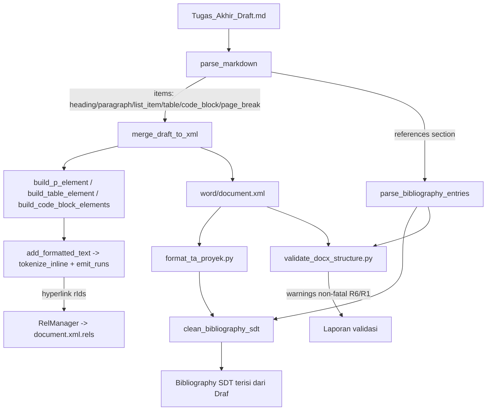

# Design Document

## Overview

Dokumen ini merancang peningkatan **Tahap_Penulisan** (konversi `Tugas_Akhir_Draft.md`
→ `word/document.xml`) yang tersebar pada dua berkas skrip:

- **Mesin_Merge** — `scratch/merge_draft_to_docx.py`: `parse_markdown`,
  `add_formatted_text`, `build_p_element`, `build_code_block_elements`,
  `build_table_element`, `merge_draft_to_xml`.
- **Penulis_Bibliografi** — `clean_bibliography_sdt()` pada
  `skills/scripts/format_ta_proyek.py`.

Prinsip perancangan tertinggi adalah **non-destruktivitas (preservasi)**: setiap
konstruk yang hari ini sudah dirender benar WAJIB menghasilkan keluaran yang
identik dengan **Output_Baseline**. Semua kemampuan baru bersifat
**Opt_In_By_Content** — hanya aktif bila Draf benar-benar memuat sintaks
pemicunya, sehingga dokumen tanpa sintaks itu tidak berubah satu byte pun.

Enam area peningkatan dipetakan ke kebutuhan R1–R6, dengan R7 sebagai sabuk
pengaman preservasi lintas-area:

| Req | Area | Lokasi perubahan inti |
|-----|------|------------------------|
| R1 | Daftar Pustaka dinamis + cross-check sitasi | `clean_bibliography_sdt` (+ parser entri baru), `validate_docx_structure.py` |
| R2 | Tokenizer inline tangguh | `add_formatted_text` (refactor jadi tokenizer + emitter), rels hyperlink di `merge_draft_to_xml` |
| R3 | Nesting daftar oleh indentasi | `parse_markdown` (perhitungan level) |
| R4 | Penomoran daftar terurut (opsional) | `build_p_element` (jalur `numPr` opt-in) |
| R5 | Tabel pipa + perataan | `parse_markdown` (deteksi) + `build_table_element` (perataan) |
| R6 | Writing guards non-fatal | `validate_docx_structure.py` + kolektor murni di Mesin_Merge |
| R7 | Preservasi lintas-area | uji baseline-equivalence + batas perubahan |

### Catatan sinkronisasi berkas (task concern)

Pipeline produksi menjalankan **salinan `scratch/` untuk merge** dan **salinan
`skills/scripts/` untuk format/validasi**. Terdapat dua salinan
`validate_docx_structure.py` (`scratch/` dan `skills/scripts/`). Karena perubahan
R1/R6 menyentuh validator dan `clean_bibliography_sdt`, **kedua salinan WAJIB
dijaga sinkron**. Desain menetapkan satu sumber logika murni (fungsi pure yang
sama di kedua salinan atau modul bersama yang di-`import`) agar tidak terjadi
divergensi perilaku. Ini ditandai sebagai perhatian khusus pada fase tasks.

### Keputusan kunci yang membingkai desain

1. **Draf sebagai sumber kebenaran Daftar_Pustaka (Option B).** Preservasi R1
   berlaku pada **format/gaya rendering**, bukan pada himpunan 9 entri hardcoded
   lama. Himpunan entri mengikuti `# DAFTAR PUSTAKA` Draf (saat ini 8 entri).
2. **Opt_In_By_Content sebagai mekanisme preservasi utama.** Jalur kode baru
   hanya tereksekusi bila pemicu sintaks terdeteksi; jika tidak, alur jatuh ke
   jalur lama yang tidak berubah.
3. **Pemisahan logika murni vs efek samping XML.** Tokenizer, parser entri
   referensi, parser tabel pipa, dan kolektor guard dirancang sebagai fungsi
   **murni** (mudah diuji property-based), sementara emisi `w:r`/`w:tbl`/rels
   tetap menjadi lapisan tipis di atasnya.

## Architecture

### Alur Tahap_Penulisan (sesudah perubahan)



### Di mana tiap perubahan duduk

- **`parse_markdown`** (R3, R5, R6): menambah perhitungan `level` daftar dari
  indentasi; menambah deteksi Tabel_Pipa (header + Baris_Pemisah) di samping
  jalur `[TABLE]` yang ada; menangkap bagian `# DAFTAR PUSTAKA` sebagai daftar
  Entri_Referensi terstruktur; mengumpulkan sinyal guard (blok `[TABLE]` tak
  tertutup, emphasis tak seimbang, urutan heading/BAB).
- **`add_formatted_text`** (R2): di-refactor menjadi dua bagian — `tokenize_inline`
  (murni, menghasilkan daftar token) dan `emit_runs` (menempel `w:r` ke paragraf).
  Mendukung `**`, `*`, `***`, `\*`, `` `code` ``, dan `[teks](url)`.
- **`build_table_element`** (R5): menerima metadata perataan per kolom dan
  menerapkan `w:jc` sel sesuai kolom; jalur data `[TABLE]` tidak berubah.
- **`build_p_element`** (R4): menambah cabang opsional `numPr` untuk daftar
  terurut; default tetap menulis penanda literal.
- **`merge_draft_to_xml`** (R2): mengelola relationship hyperlink (alokasi `rId`,
  penulisan ke `word/_rels/document.xml.rels`) melalui `RelManager`.
- **`clean_bibliography_sdt`** (R1): membaca Entri_Referensi dari Draf (via
  `parse_bibliography_entries`) alih-alih `refs_data` hardcoded, lalu merender
  dengan pPr/urutan yang identik dengan baseline.
- **`validate_docx_structure.py`** (R6, R1): menambah guard non-fatal (heading,
  BAB, tabel tak tertutup, emphasis, cross-check sitasi) secara **aditif**.

### Aliran Daftar_Pustaka dari Draf ke SDT (R1 — keputusan eksplisit)

Saat ini ada potensi **render ganda**: `parse_markdown` menangkap seluruh Draf
mulai `# BAB I` hingga akhir, termasuk `# DAFTAR PUSTAKA` dan entri-entrinya,
sehingga entri bisa muncul sebagai paragraf body biasa; sementara template juga
memiliki **Bibliography SDT** yang ditimpa oleh `clean_bibliography_sdt`.

Keputusan desain: **SDT adalah satu-satunya kanal render Daftar_Pustaka**
(Penulis_Bibliografi = `clean_bibliography_sdt`, sesuai glossary requirements).
Karena itu:

1. `parse_markdown` menandai bagian `# DAFTAR PUSTAKA` secara khusus: heading
   `# DAFTAR PUSTAKA` tetap diemisikan seperti baseline, tetapi entri di bawahnya
   dikumpulkan ke koleksi terpisah `references` (tidak diemisikan sebagai paragraf
   body ganda bila SDT aktif). Perilaku emisi diatur agar **identik dengan
   Output_Baseline**: bila baseline saat ini sudah merender entri di body, jalur
   lama dipertahankan dan SDT-lah yang menjadi sumber tunggal — keputusan final
   ini diverifikasi terhadap baseline yang ditangkap (lihat R7). Bila ditemukan
   duplikasi pada baseline, dedup dianggap perbaikan yang diizinkan hanya jika
   tidak mengubah nomor kapsi/heading lain; jika berisiko, opsi konservatif adalah
   mempertahankan perilaku baseline dan hanya mengganti **isi SDT** menjadi
   draft-authoritative.
2. `clean_bibliography_sdt(sdt_elem, entries=None, draft_path=...)` menerima
   `entries` (hasil `parse_bibliography_entries`). Jika `entries` tidak diberikan,
   ia membaca `draft_path` sendiri sehingga tetap berfungsi sebagai pass
   independen pada `format_ta_proyek.py`.

> Keputusan dedup di atas WAJIB dikonfirmasi dengan menangkap Output_Baseline
> lebih dulu (R7) sebelum implementasi. Ini ditandai sebagai task concern.

## Components and Interfaces

### 1. Tokenizer inline (R2)

```python
# scratch/merge_draft_to_docx.py — fungsi murni baru

# Jenis token (lihat Data Models).
def tokenize_inline(text: str) -> list[InlineToken]:
    """Ubah teks ber-markup inline menjadi daftar token datar.

    Mendukung: '**' (bold toggle), '*' (italic toggle), '***' (bold+italic),
    '\\*' (asterisk literal), '`code`' (kode inline), '[teks](url)' (tautan).
    Penanda emphasis yang tidak berpasangan diperlakukan sebagai TEXT literal
    (tidak membawa state ke teks setelahnya).
    Murni & deterministik: tidak menyentuh lxml.
    """

def emit_runs(p_elem, tokens: list[InlineToken], default_rPr=None,
              rel_manager: "RelManager | None" = None) -> None:
    """Tempelkan w:r (dan w:hyperlink untuk token LINK) ke paragraf p_elem.

    Mereplikasi byte-per-byte rPr baseline (rFonts Times New Roman, sz/szCs 24,
    w:b/bCs untuk bold, w:i/iCs untuk italic) untuk token TEXT, sehingga teks
    tanpa Konstruk_Baru identik dengan Output_Baseline. Token CODE memakai
    rFonts Consolas. Token LINK membungkus run dalam w:hyperlink ber-r:id yang
    dialokasikan rel_manager.
    """

def add_formatted_text(p_elem, text, default_rPr=None, rel_manager=None):
    """Wrapper kompatibel: emit_runs(p_elem, tokenize_inline(text), ...).
    Tanda tangan lama tetap dipertahankan (rel_manager opsional)."""
```

**Algoritma `tokenize_inline` (presisi):**

1. Inisialisasi: `i = 0`, `buf = []` (akumulasi karakter literal), `tokens = []`,
   state `bold=False`, `italic=False`. Helper `flush()` mengubah `buf` menjadi
   token `TEXT` dengan flag `(bold, italic)` aktif saat itu, lalu mengosongkan `buf`.
2. Pemindaian kiri→kanan:
   - `\\*` (backslash + asterisk) → tambahkan `*` ke `buf` (literal), `i += 2`.
   - `` ` `` → cari `` ` `` penutup berikutnya. Jika ada: `flush()`, lalu token
     `CODE(text=isi)`, `i` lompat ke setelah penutup. Jika tidak ada penutup →
     perlakukan backtick sebagai literal (`buf += '`'`, `i += 1`).
   - `[` → coba cocokkan pola tautan `\[([^\]]*)\]\(([^)]*)\)` pada posisi `i`.
     Jika cocok: `flush()`, token `LINK(text, url)`, `i` lompat ke akhir match.
     Jika tidak → `[` literal.
   - `***` → `flush()`, toggle `bold` dan `italic` sekaligus, `i += 3`.
   - `**` → `flush()`, toggle `bold`, `i += 2`.
   - `*` → `flush()`, toggle `italic`, `i += 1`.
   - selain itu → `buf += text[i]`, `i += 1`.
3. Akhir input: `flush()`. **Rekonsiliasi tak seimbang (R2.7):** bila pada akhir
   `bold` atau `italic` masih `True`, berarti ada penanda pembuka tanpa penutup.
   Tokenizer melakukan **pass dua**: ulangi tokenisasi dalam mode di mana setiap
   penanda yang TIDAK berhasil ditutup diperlakukan sebagai karakter literal pada
   posisinya, dan state tidak pernah bocor melewati akhir teks. Implementasi
   konkret: tokenisasi mencatat indeks tiap toggle; bila jumlah toggle untuk satu
   jenis ganjil, toggle terakhir yang tak berpasangan dikonversi menjadi literal
   `*`/`**` pada buffer, dan flag dikembalikan ke `False`. Hasilnya: tidak ada run
   sesudahnya yang mewarisi format dari penanda yatim.

**Emisi run & rels hyperlink:** `emit_runs` memetakan token:
- `TEXT` → satu `w:r` dengan `rPr` baseline + `w:b/bCs` jika `bold`, `w:i/iCs`
  jika `italic`. (Identik dengan jalur lama untuk teks tanpa konstruk baru.)
- `CODE` → `w:r` dengan `rFonts` Consolas (mengikuti gaya kode `build_code_block_elements`).
- `LINK` → `w:hyperlink r:id="rIdN"` membungkus `w:r` (gaya karakter `Hyperlink`
  yang sudah disediakan `ensure_hyperlink_style`). `RelManager.add_external(url)`
  mengembalikan `rIdN` dan mencatat relationship `Type=.../hyperlink`,
  `TargetMode="External"` untuk ditulis ke `word/_rels/document.xml.rels`.

```python
class RelManager:
    """Alokasi & penulisan relationship eksternal (hyperlink) ke document.xml.rels."""
    def add_external(self, url: str) -> str: ...   # -> rId, dedup url identik
    def write(self, rels_path: str) -> None: ...    # tambahkan Relationship baru, preservasi yang ada
```

### 2. Parser Entri Referensi (R1)

```python
# Dipakai oleh clean_bibliography_sdt DAN validate_docx_structure.py (cross-check).
def parse_bibliography_entries(draft_path_or_text) -> list[ReferenceEntry]:
    """Baca bagian '# DAFTAR PUSTAKA' Draf, kembalikan daftar ReferenceEntry
    sesuai urutan kemunculan. Setiap baris non-kosong di bawah heading sampai
    heading '#' berikutnya / '---' dianggap satu entri.
    Bila heading '# DAFTAR PUSTAKA' tidak ada -> kembalikan [] dan tandai
    'section_found = False' (R1.8)."""

def parse_italic_spans(raw: str) -> list[tuple[str, bool]]:
    """Pecah satu entri menjadi segmen (teks, is_italic) berdasarkan '*...*'.
    Reuse tokenize_inline (italic) agar konsisten dengan R2."""

def reference_key(entry: ReferenceEntry) -> tuple[str, str]:
    """Kunci pencocokan: (surname penulis pertama, tahun). Diturunkan dari pola
    awal entri APA 'Surname, Inisial. ... (Tahun).'"""
```

`clean_bibliography_sdt` direfaktor:

```python
def clean_bibliography_sdt(sdt_elem, entries=None, draft_path="Tugas_Akhir_Draft.md"):
    """Isi Bibliography SDT dari Entri_Referensi Draf (Option B).
    - entries: list[ReferenceEntry]; bila None -> parse_bibliography_entries(draft_path).
    - Untuk tiap entri: bangun w:p dengan pPr IDENTIK baseline
      (pStyle Normal; ind left=567 hanging=567; spacing before=0 after=120
       line=240 lineRule=auto; jc=both), lalu runs dari parse_italic_spans:
      segmen biasa -> w:r polos; segmen miring -> w:r dengan w:i/w:iCs.
    - Urutan entri = urutan Draf (R1.4).
    - Bila tidak ada entri -> jangan tulis entri palsu; cetak 1 warning (R1.8)."""
```

### 3. Parser Tabel Pipa (R5)

```python
def is_pipe_table_separator(line: str) -> bool:
    """True bila baris berupa Baris_Pemisah: sel-sel cocok ^:?-{1,}:?$ setelah
    di-split '|' (mis. '---', ':---', ':---:', '---:')."""

def parse_alignment_row(line: str) -> list[Alignment]:
    """Petakan tiap sel Baris_Pemisah ke Alignment (LEFT/CENTER/RIGHT/DEFAULT)."""

def detect_pipe_table(lines: list[str], start_idx: int) -> tuple[int, dict] | None:
    """Bila lines[start_idx] adalah baris berisi '|' dan lines[start_idx+1]
    adalah Baris_Pemisah dengan jumlah kolom cocok, kumpulkan baris berikutnya
    yang mengandung '|' sampai baris kosong. Kembalikan (end_idx, item) dengan
    item = {'type':'table','lines':[...data tanpa separator...],
            'alignments':[...], 'is_pipe': True}."""
```

`build_table_element(item)` diperluas: bila `item.get('alignments')` ada, terapkan
`w:jc` per sel mengikuti kolomnya; baris pertama tetap `tblHeader` + bold; bila
`alignments` tidak ada (jalur `[TABLE]`), perilaku **identik baseline**.

### 4. Perhitungan level daftar (R3)

```python
LIST_INDENT_UNIT = 2   # spasi per level (Markdown standar; lihat Data Models)

def compute_list_level(indent_spaces: int, marker: str) -> int:
    """Level dari indentasi: level = 1 + floor(indent_spaces / LIST_INDENT_UNIT).
    Marker bersifat kosmetik (R3.2). Untuk indent 0 -> level 1 (terluar, R3.5).
    Kompatibilitas mundur (R3.4): lihat catatan pemetaan baseline di Data Models."""
```

### 5. Kolektor Guard (R6) — fungsi murni di Mesin_Merge, dikonsumsi Validator

```python
def collect_heading_level_warnings(items) -> list[str]:   # R6.1
def collect_bab_order_warnings(items) -> list[str]:        # R6.2
def collect_unclosed_table_warnings(lines) -> list[str]:   # R6.4
def collect_unbalanced_emphasis_warnings(lines) -> list[str]:  # R6.5
def collect_citation_crosscheck_warnings(body_text, entries, *, fatal=False):  # R1.5/1.6/6.3
    """Dua arah:
    - sitasi in-text (Nama, Tahun)/(Nama et al., Tahun) tanpa entri -> warning.
    - entri tak pernah dirujuk -> warning.
    Kembalikan (warnings, has_fatal). 'fatal' dikontrol konfigurasi (R1.7)."""
```

Validator memanggil kolektor ini dan mencetak `[WARN]` non-fatal; hanya
menambah ke `errors_found` (fatal) bila mode cross-check `fatal=True`
dikonfigurasi (env/flag), sesuai R1.7. Seluruh check lama tidak diubah (R6.6).

## Data Models

### Token inline

```python
from dataclasses import dataclass
from enum import Enum

class TokenKind(Enum):
    TEXT = "text"      # teks biasa, dengan flag bold/italic
    CODE = "code"      # kode inline -> monospace
    LINK = "link"      # tautan -> w:hyperlink

@dataclass(frozen=True)
class InlineToken:
    kind: TokenKind
    text: str
    bold: bool = False
    italic: bool = False
    url: str | None = None   # hanya untuk LINK
```

### Entri Referensi

```python
@dataclass(frozen=True)
class ReferenceEntry:
    raw: str                     # baris entri verbatim dari Draf (tanpa newline)
    spans: tuple                 # tuple[(teks:str, is_italic:bool), ...] hasil parse_italic_spans
    authors: tuple               # tuple surname penulis (untuk kunci & cross-check)
    year: str | None             # tahun publikasi (dari '(YYYY)')
```

`spans` adalah representasi render-ready: rekonstruksi teks (`"".join(t for t,_ in spans)`)
= `raw` dengan penanda `*` dihapus. Ini menjamin fidelity Rentang_Miring (R1.2).

### Enum perataan kolom

```python
class Alignment(Enum):
    DEFAULT = "left"   # tanpa ':' -> perilaku kolom default (kiri, seperti baseline sel)
    LEFT = "left"      # :---
    CENTER = "center"  # :---:
    RIGHT = "right"    # ---:
```

Nilai dipetakan langsung ke `w:jc/@w:val`.

### Item Parser_Markdown (diperluas, tetap kompatibel)

- `heading`: `{type, level, text}` — tak berubah.
- `paragraph`: `{type, text}` — tak berubah.
- `list_item`: `{type, level, marker, text}` — `level` kini dihitung
  `compute_list_level(indent_spaces, marker)`; `marker` tetap kosmetik.
- `table` (Tabel_Kurung): `{type, lines}` — tak berubah (tanpa `alignments`).
- `table` (Tabel_Pipa): `{type, lines, alignments, is_pipe: True}` — baru.
- `code_block`, `page_break`: tak berubah.
- `references`: koleksi terpisah `list[ReferenceEntry]` + flag `section_found`.

### Pemetaan level daftar ke baseline (R3.4 — kompatibilitas mundur)

Draf saat ini mengandalkan **jenis penanda** untuk level (lihat `build_p_element`:
`left_dxa = level * 360`). Pemetaan baseline lama: `1.`→1, `a.`→2, `1)`→3, `a)`→4.
Aturan indentasi baru `level = 1 + floor(indent/2)` WAJIB mereproduksi level
baseline untuk Draf saat ini. Strategi:

- Tangkap indentasi nyata tiap `list_item` Draf saat ini dan verifikasi bahwa
  `compute_list_level(indent, marker)` menghasilkan `left`/`hanging` dxa yang
  sama dengan Output_Baseline (uji baseline-equivalence, R7).
- Bila Draf saat ini ternyata tidak memakai indentasi (semua marker di kolom 0),
  maka demi preservasi, `compute_list_level` memakai **mode kompatibilitas**:
  ketika seluruh item satu daftar berindentasi 0, level dipetakan dari marker
  seperti baseline; mode indentasi-murni hanya aktif bila Draf memuat indentasi
  nyata (Opt_In_By_Content). Keputusan final dipilih setelah inspeksi baseline
  dan dikunci oleh uji preservasi.

## Correctness Properties

*Sebuah properti adalah karakteristik atau perilaku yang harus berlaku benar di
seluruh eksekusi sistem yang valid — pernyataan formal tentang apa yang
seharusnya dilakukan sistem. Properti menjembatani spesifikasi yang dapat dibaca
manusia dengan jaminan kebenaran yang dapat diverifikasi mesin.*

Properti berikut diturunkan dari prework. Konstruk yang diuji berupa **fungsi
murni** (tokenizer, parser entri referensi, parser tabel pipa, perhitungan level
daftar, kolektor guard) sehingga 100+ iterasi murah. Properti preservasi memakai
**oracle baseline**: implementasi/keluaran lama dijadikan acuan, dan keluaran baru
dibandingkan byte-per-byte saat konten tidak memuat Konstruk_Baru.

### Property 1: Parsing entri referensi mempertahankan jumlah dan urutan

*Untuk setiap* bagian `# DAFTAR PUSTAKA` yang terdiri atas k baris entri
non-kosong, `parse_bibliography_entries` menghasilkan tepat k `ReferenceEntry`
dengan `raw` dan urutan yang sama persis dengan urutan kemunculan pada Draf.

**Validates: Requirements 1.1, 1.4**

### Property 2: Fidelity Rentang_Miring (round-trip span)

*Untuk setiap* entri yang dibangun dari urutan segmen `(teks, is_italic)`, setelah
dirender ke Markdown (`*...*` untuk segmen miring) lalu di-parse ulang via
`parse_italic_spans`, segmen yang dihasilkan setara dengan segmen asal; dan
gabungan teks seluruh segmen sama dengan `raw` setelah penanda `*` dihapus.

**Validates: Requirements 1.2**

### Property 3: Invarian gaya paragraf bibliografi

*Untuk setiap* daftar `ReferenceEntry`, setiap paragraf yang dirender
`clean_bibliography_sdt` memiliki `pPr` identik: `pStyle=Normal`, `ind left=567
hanging=567`, `spacing before=0 after=120 line=240 lineRule=auto`, dan `jc=both`.

**Validates: Requirements 1.3, 1.9**

### Property 4: Kelengkapan pemeriksaan silang sitasi → Daftar_Pustaka

*Untuk setiap* pasangan (kumpulan Sitasi_In_Text, kumpulan Entri_Referensi),
setiap sitasi yang kuncinya (nama, tahun) tidak memiliki entri padanan
menghasilkan tepat satu peringatan yang memuat nama dan tahun sitasi tersebut,
dan tidak ada peringatan untuk sitasi yang memiliki padanan.

**Validates: Requirements 1.5, 6.3**

### Property 5: Kelengkapan pemeriksaan silang Daftar_Pustaka → sitasi

*Untuk setiap* pasangan (kumpulan Entri_Referensi, kumpulan Sitasi_In_Text),
setiap entri yang tidak pernah dirujuk sitasi mana pun menghasilkan tepat satu
peringatan yang menyebut entri tersebut, dan tidak ada peringatan untuk entri
yang dirujuk.

**Validates: Requirements 1.6, 6.3**

### Property 6: Kebenaran format token inline

*Untuk setiap* teks pemicu yang valid, `tokenize_inline` menghasilkan token dengan
atribut benar: `**x**`→TEXT bold; `*x*`→TEXT italic; `***x***`→TEXT bold+italic;
`` `x` ``→CODE dengan teks isi; `[t](u)`→LINK dengan `text=t` dan `url=u`.

**Validates: Requirements 2.1, 2.2, 2.3, 2.5, 2.6**

### Property 7: Escape literal dan tanpa kebocoran state

*Untuk setiap* teks, `\*` menghasilkan tepat satu karakter `*` literal tanpa
mengubah state tebal/miring; dan untuk teks dengan penanda emphasis tak seimbang,
penanda yatim diperlakukan sebagai literal serta tidak ada token sesudahnya yang
mewarisi format dari penanda yang tidak tertutup.

**Validates: Requirements 2.4, 2.7**

### Property 8: Preservasi tokenizer terhadap baseline

*Untuk setiap* teks yang hanya terdiri atas teks biasa dan span `**...**`/`*...*`
yang seimbang (tanpa Konstruk_Inline baru), run yang diemisikan `emit_runs`
identik byte-per-byte dengan keluaran tokenizer baseline (oracle `add_formatted_text` lama).

**Validates: Requirements 2.8, 2.9**

### Property 9: Level daftar monoton dan invarian terhadap penanda

*Untuk setiap* indentasi dan penanda, `compute_list_level` menghasilkan level yang
hanya bergantung pada indentasi (penanda tidak memengaruhi level); indentasi 0
menghasilkan level terluar; dan untuk indentasi a ≤ b berlaku level(a) ≤ level(b).

**Validates: Requirements 3.1, 3.2, 3.3, 3.5**

### Property 10: Struktur dan perataan Tabel_Pipa

*Untuk setiap* Tabel_Pipa dengan Baris_Pemisah dan vektor perataan acak,
`build_table_element` menghasilkan `w:tbl` di mana baris pertama ber-`tblHeader`,
Baris_Pemisah tidak menjadi `w:tr` data, jumlah baris data = jumlah baris non-separator,
dan setiap sel pada kolom-j memiliki `w:jc` sesuai `alignments[j]`.

**Validates: Requirements 5.1, 5.2, 5.3**

### Property 11: Ekuivalensi Tabel_Kurung terhadap baseline

*Untuk setiap* data blok `[TABLE]`, `build_table_element` (tanpa `alignments`)
menghasilkan `w:tbl` yang identik byte-per-byte dengan keluaran baseline untuk
data yang sama.

**Validates: Requirements 5.4, 5.5**

### Property 12: Guard lompatan level heading

*Untuk setiap* urutan heading, `collect_heading_level_warnings` menghasilkan tepat
satu peringatan (memuat lokasi dan level terlewat) pada setiap transisi yang
menaik lebih dari satu level, dan tidak ada peringatan untuk transisi yang naik
paling banyak satu level.

**Validates: Requirements 6.1**

### Property 13: Guard urutan BAB

*Untuk setiap* urutan nomor BAB, `collect_bab_order_warnings` menghasilkan
peringatan tepat ketika sebuah BAB tidak menaik secara berurutan terhadap BAB
sebelumnya, dan tidak ada peringatan ketika urutan menaik berurutan.

**Validates: Requirements 6.2**

### Property 14: Guard blok [TABLE] tak tertutup

*Untuk setiap* kumpulan baris draf, `collect_unclosed_table_warnings`
menghasilkan tepat satu peringatan bila terdapat `[TABLE]` yang dibuka tanpa
`[/TABLE]` penutup, dan tidak ada peringatan bila setiap `[TABLE]` tertutup.

**Validates: Requirements 6.4**

### Property 15: Guard emphasis tak seimbang

*Untuk setiap* baris, `collect_unbalanced_emphasis_warnings` menghasilkan
peringatan yang menyebut baris tersebut tepat ketika jumlah penanda emphasis
tidak seimbang (mengabaikan `\*` yang di-escape), dan tidak ada peringatan ketika
penanda seimbang.

**Validates: Requirements 6.5**

### Property 16: Preservasi lintas-area Opt_In_By_Content (tingkat dokumen)

*Untuk setiap* Draf yang tidak memuat Konstruk_Baru (tanpa kode inline, tautan,
`***`, `\*`, maupun Tabel_Pipa), keluaran lengkap Tahap_Penulisan identik
byte-per-byte dengan Output_Baseline untuk Draf tersebut.

**Validates: Requirements 5.6, 7.7**

## Error Handling

Filosofi: peningkatan ini **menambah peringatan, bukan kegagalan**. Default
seluruh guard baru bersifat **non-fatal** dan tidak boleh mengubah kode keluar
(exit code) validator yang sudah ada.

- **R1.5/R1.6/R6.3 — cross-check sitasi:** `collect_citation_crosscheck_warnings`
  mencetak baris `[WARN][sitasi]` per ketidakcocokan (dua arah). Default non-fatal.
  **R1.7:** bila mode fatal diaktifkan (env `TA_CITATION_FATAL=1` atau flag),
  ketidakcocokan ditambahkan ke `errors_found` sehingga validator keluar non-zero.
- **R1.8 — bagian referensi tidak ditemukan:** `parse_bibliography_entries`
  mengembalikan `[]` dan `section_found=False`; `clean_bibliography_sdt` mencetak
  satu `[WARN]` "sumber Daftar_Pustaka tidak ditemukan" dan **tidak** menulis
  entri palsu (SDT dikosongkan secara terdefinisi, bukan diisi data lama).
- **R6.1 — lompatan level heading:** satu `[WARN][heading]` per lompatan,
  menyebut indeks/teks heading dan level yang terlewat.
- **R6.2 — urutan BAB:** satu `[WARN][bab]` per BAB yang tidak berurutan.
- **R6.4 — `[TABLE]` tak tertutup:** Parser_Markdown mendeteksi blok terbuka di
  akhir berkas; validator mencetak satu `[WARN][tabel]`. Mesin_Merge tetap
  menutup blok secara aman (tidak crash) agar dokumen tetap terbentuk.
- **R6.5 — emphasis tak seimbang:** satu `[WARN][emphasis]` per baris; render
  tetap berjalan karena tokenizer meliteralkan penanda yatim (Property 7).
- **Tokenizer tautan rusak (`[teks](` tanpa `)`):** diperlakukan literal (bukan
  LINK), tidak ada relationship dialokasikan, tidak ada error.
- **RelManager:** URL identik dipakai ulang (dedup `rId`); penulisan
  `document.xml.rels` mempertahankan seluruh relationship lama (aditif).

Seluruh pesan peringatan ditulis ke stdout dengan prefiks `[WARN]` yang konsisten
agar mudah ditelusuri dan tidak tertukar dengan temuan fatal `errors_found`.

## Testing Strategy

### Pendekatan ganda

- **Unit test (contoh & kasus batas):** mode fatal cross-check (R1.7), bagian
  referensi hilang (R1.8), jalur `numPr` opt-in (R4.1/4.2), tautan rusak, dan
  snapshot baseline konkret (R1.9, R3.4, R5.5, R7.3).
- **Property test (universal):** Properti 1–16 di atas, masing-masing satu uji
  berbasis properti.
- **Integration test:** R6.7, R7.1, R7.2, R7.5, R7.6 — bangun docx dari Draf saat
  ini, jalankan `validate_docx_structure.py` (nol fatal), dan jalankan ulang
  suite `dynamic-generation-pipeline` serta `image-injection-pipeline-fix`.

### PBT berlaku di sini

Tahap_Penulisan inti adalah transformasi murni (parsing/tokenisasi/serialisasi
ke XML), sehingga PBT tepat. Library: **Hypothesis** (Python), konsisten dengan
suite yang ada (`tests/test_dynamic_*_properties.py`). Properti pembangun XML
(`build_table_element`, `emit_runs`) diuji dengan membandingkan elemen lxml ter-
serialisasi (`lxml.etree.tostring`) — murni dan murah, tanpa I/O berat.

### Strategi baseline-equivalence (R7 — sabuk pengaman preservasi)

1. **Tangkap baseline lebih dulu:** sebelum perubahan apa pun, jalankan
   Tahap_Penulisan pada Draf saat ini dan simpan `word/document.xml` (dan docx)
   sebagai **Output_Baseline** di `tests/fixtures/` (mis. `baseline_document.xml`).
2. **Oracle fungsi murni:** untuk Property 8 dan 11, simpan salinan implementasi
   baseline (`add_formatted_text`/`build_table_element` lama) sebagai oracle, lalu
   bandingkan keluaran baru byte-per-byte pada input tanpa Konstruk_Baru.
3. **Property 16 (tingkat dokumen):** generate Draf sintetis hanya dari konstruk
   lama (heading, paragraf balanced **/*, `[TABLE]`, list), jalankan pipeline
   baru, dan tegaskan kesamaan byte-per-byte dengan jalur baseline.
4. **Snapshot konkret:** simpan potongan baseline untuk Tabel 1.1/1.2/3.1–3.4,
   entri Daftar_Pustaka Draf (8 entri), level daftar, dan nomor kapsi; uji
   menegaskan keluaran baru sama.
5. **Gerbang regresi:** seluruh `tests/` WAJIB tetap hijau (R7.5); guard baru
   hanya aditif (R6.6) dan tidak mengubah exit code default validator (R7.1).

### Konfigurasi property test

- Minimum **100 iterasi** per properti (`@settings(max_examples=...)`,
  gunakan ≥100; ikuti pola suite yang ada yang memakai 200).
- Setiap uji properti diberi tag komentar yang merujuk properti desain:
  **Feature: writing-pipeline-improvements, Property {nomor}: {teks properti}**.
- Setiap properti diimplementasikan oleh **satu** uji berbasis properti; kasus
  batas spesifik (escape, separator nyeleneh, indent 0) dijamin lewat generator
  pada properti terkait, bukan uji terpisah yang berlebihan.

### Catatan sinkronisasi & batas perubahan (R7.4)

- Logika murni baru (tokenizer, parser entri, parser tabel pipa, kolektor guard)
  diletakkan di `scratch/merge_draft_to_docx.py` dan di-`import` oleh uji
  (mengikuti pola `tests/test_dynamic_merge_properties.py`).
- `clean_bibliography_sdt` diubah hanya pada sumber data (Draf) dan tetap merender
  pPr identik baseline.
- Guard validator ditambahkan ke **kedua salinan** `validate_docx_structure.py`
  (`scratch/` dan `skills/scripts/`) secara identik, atau di-faktor ke fungsi
  murni bersama, untuk menjaga sinkronisasi (task concern).
- Tidak ada perubahan pada semantik injeksi gambar maupun penomoran kapsi.
