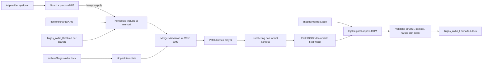

# Dokumentasi Fitur, Aturan, dan Pipeline Tugas Akhir

Dokumen ini adalah panduan teknis dan operasional terpadu untuk repository laporan Tugas Akhir Proyek UPNVJ FIK 2025. Isinya mencakup sumber data, aturan penulisan, format kampus, workflow penulisan otomatis, konversi Markdown ke DOCX, pengelolaan gambar dan tabel, validasi, pengujian, serta troubleshooting.

> Status dokumentasi: diselaraskan dengan codebase pada 19 Juli 2026.
>
> Jika terdapat perbedaan, sumber kanonik pada bagian [Urutan sumber acuan](#urutan-sumber-acuan) harus didahulukan. Dokumentasi ini menjelaskan perilaku implementasi yang aktif, tetapi tidak menggantikan aturan kampus resmi.

## Ringkasan sistem

Repository memiliki tiga tahap yang saling melengkapi tetapi tetap terpisah:

1. **Generator konten AI opsional** membuat request/proposal/diff untuk satu subbab. Mode default tidak menulis draf; apply harus diotorisasi eksplisit.
2. **Workflow penulisan Markdown deterministik** membantu menjaga kerangka empat bab, fakta proyek, konsistensi istilah, posisi rujukan gambar/tabel, dan isi wajib. Workflow ini tersedia sebagai library Python dan hanya mengubah `Tugas_Akhir_Draft.md` ketika dipanggil secara eksplisit.
3. **Pipeline DOCX** memperluas shared content ke draf di memori, menggabungkan hasilnya ke template, menerapkan format kampus, memperbarui field Word, menyuntikkan gambar, lalu menjalankan validasi final. Output utamanya adalah `Tugas_Akhir_Formatted.docx`; pipeline ini tidak memanggil provider AI.



## Urutan sumber acuan

Gunakan urutan berikut ketika mengubah isi atau aturan:

| Prioritas | Sumber | Fungsi |
|---|---|---|
| 1 | Pedoman resmi kampus | Ketentuan akademik tertinggi |
| 2 | `skills/references/format-spec-upnvj.md` | Format dokumen yang menjadi acuan kedua skill |
| 3 | `skills/references/outline-4bab.md` | Struktur kanonik laporan empat bab |
| 4 | `.kiro/steering/aturan-penulisan.md` | Aturan penulisan draf |
| 5 | `.kiro/steering/aturan-sitasi.md` | Aturan sitasi dan penulisan ilmiah |
| 6 | `.kiro/steering/konteks-proyek.md` | Arsitektur dan fakta umum sistem |
| 7 | `project_facts.json` | Fakta dan status implementasi yang boleh dinyatakan |
| 8 | `term_registry.json` | Bentuk istilah teknis yang konsisten |
| 9 | `content/shared/` dan draf/role content branch | Isi laporan aktif yang diturunkan dari fakta serta aturan kanonik |
| 10 | `skills/scripts/` | Implementasi pipeline yang dilacak Git |
| 11 | `scratch/` | Salinan runtime; bukan sumber utama untuk diedit |

Empat script di `scratch/` disalin ulang dari `skills/scripts/` setiap build: `merge_draft_to_docx.py`, `patch_template.py`, `inject_all_images.py`, dan `validate_docx_structure.py`. Perubahan permanen harus dilakukan pada versi di `skills/scripts/`.

## Struktur berkas penting

| Berkas/direktori | Keterangan |
|---|---|
| `Tugas_Akhir_Draft.md` | Sumber isi utama mulai BAB I; front matter dipertahankan dari template |
| `content/README.md` | Kontrak shared content, role content, keamanan identitas, dan penggunaan include |
| `content/shared/` | Sumber kanonik bagian laporan yang identik pada semua branch |
| `content/roles/` | Lokasi opsional narasi khusus peran; tidak boleh menduplikasi shared content |
| `archive/Tugas Akhir.docx` | Template Word sumber |
| `Tugas_Akhir_Formatted.docx` | Output build final |
| `project_facts.json` | Basis fakta untuk mencegah klaim yang belum terverifikasi |
| `term_registry.json` | Registry istilah kanonik |
| `images/manifest.json` | Daftar aset gambar branch, ID stabil, dan assertion caption |
| `images/manifest_reconcile.json` | Allow-list exception integritas yang sah dan khusus branch; jangan disalin buta antarbranch |
| `skills/scripts/build_pipeline.py` | Orkestrator build end-to-end |
| `skills/scripts/generate_content.py` | CLI proposal AI provider-neutral; suggest default, apply eksplisit |
| `skills/scripts/alur_penulisan/` | Library workflow penulisan Markdown |
| `skills/references/` | Format dan outline kanonik |
| `.kiro/steering/` | Aturan penulisan, sitasi, dan konteks proyek |
| `.kiro/specs/` | Requirement, desain, dan task historis setiap fitur |
| `tests/` | Unit test, property-based test, integration test, fixture, dan regression test |
| `diagrams/` | Sumber diagram-as-code dan aset terkait |
| `journal/` | Referensi jurnal lokal |
| `unpacked_ta/` | Folder kerja sementara; dibersihkan setelah build berhasil |

## Prasyarat lingkungan

Pipeline saat ini dirancang untuk lingkungan berikut:

- Windows.
- Python tersedia di `C:\Python312\python.exe`. Lokasi ini masih hard-coded di `build_pipeline.py`.
- Microsoft Word terpasang untuk pembaruan field melalui COM.
- Paket runtime utama mencakup `lxml` dan `pywin32`.
- Paket pengujian mencakup `pytest`, `hypothesis`, dan `Pillow`.

Repository belum memiliki manifest dependensi seperti `requirements.txt` atau `pyproject.toml`. Karena itu, versi paket belum dikunci dan perlu dijaga secara manual.

> **Peringatan:** `build_pipeline.py` menjalankan `taskkill /f /im winword.exe` untuk melepas file lock. Simpan dan tutup semua dokumen Word sebelum memulai build karena seluruh proses Word yang sedang berjalan akan dihentikan paksa.

LibreOffice bukan komponen utama build. `pack.py` dapat mencoba validasi tambahan melalui `soffice` apabila executable tersebut tersedia. Jika instalasi LibreOffice menampilkan error `bootstrap.ini is corrupt`, lihat [LibreOffice rusak](#libreoffice-rusak).

## Aturan isi dan penulisan

### Kerangka empat bab

Struktur dasar laporan tidak boleh diubah tanpa pembaruan sumber kanonik:

| Bab | Subbab utama |
|---|---|
| BAB I Pendahuluan | 1.1 Latar Belakang; 1.2 Identifikasi Masalah; 1.3 Batasan Masalah; 1.4 Tujuan dan Manfaat; 1.5 Jadwal Kegiatan; 1.6 Sistematika Penulisan |
| BAB II Rancangan Proyek | 2.1 Observasi; 2.2 Usulan Solusi; 2.3 Rancangan Proyek; 2.4 Rencana Pengujian Proyek |
| BAB III Implementasi Proyek | 3.1 Profil Mitra; 3.2 Metode Implementasi; 3.3 Konfigurasi dan Metadata Sistem; 3.4 Laporan Implementasi Proyek; 3.5 Hasil Pengujian Proyek |
| BAB IV Penutup | 4.1 Kesimpulan; 4.2 Saran |

Rincian sub-subbab dan penekanan per peran berada di `skills/references/outline-4bab.md` dan `laporan-tim/<peran>/outline-laporan.md`.

### Daftar bertingkat

Bullet `-`, `*`, atau `+` tidak digunakan untuk daftar laporan. Hirarki yang diwajibkan adalah:

```text
1. Tingkat pertama
   a. Tingkat kedua
      1) Tingkat ketiga
         a) Tingkat keempat
```

Indentasi sumber Markdown adalah tiga spasi per tingkat. Parser menerima marker `1.`, `a.`, `1)`, dan `a)`; nesting ditentukan oleh indentasi, bukan hanya bentuk marker.

### Aturan gambar dan tabel

- Caption tabel berada **di atas** tabel.
- Caption gambar berada **di bawah** gambar.
- Caption ditulis `Tabel X.Y Deskripsi` atau `Gambar X.Y Deskripsi`, tanpa titik setelah nomor.
- Gambar dan tabel memiliki counter terpisah, mengikuti urutan baca, dan dimulai ulang pada setiap bab.
- Penyebutan `Gambar X.Y` atau `Tabel X.Y` tidak boleh mengawali kalimat/paragraf.
- Setiap gambar wajib memiliki paragraf narasi yang secara eksplisit menyebut nomor gambar tersebut dalam bab yang sama.

Aturan narasi gambar bersifat **fatal**. Bentuk yang diterima:

```text
Arsitektur sistem pada Gambar 2.1 memperlihatkan hubungan antarkomponen utama.
```

Bentuk berikut ditolak:

```text
Gambar 2.1 memperlihatkan hubungan antarkomponen utama.
```

Rujukan juga ditolak jika `Gambar X.Y` muncul tepat setelah tanda akhir kalimat `.`, `!`, atau `?`. Validator hanya mencari narasi pada paragraf biasa di bab yang sama dan mengabaikan caption, heading, daftar gambar, serta paragraf yang berisi drawing.

### Teori dan sitasi

- Setiap subbab teori diawali definisi yang memiliki minimal satu sitasi formal.
- Klaim ilmiah, angka eksternal, standar, dan perbandingan harus memiliki sumber.
- Latar Belakang harus padat sitasi; paragraf substantif tanpa sitasi dilaporkan sebagai warning.
- Observasi atau data penulis sendiri tidak memerlukan sitasi eksternal, tetapi harus merujuk data internal, survei, responden, atau lampiran yang relevan.
- Sitasi dalam teks dan Daftar Pustaka diperiksa dua arah.
- Ketidaksesuaian sitasi menjadi warning secara default dan dapat dinaikkan menjadi fatal.
- Jangan membuat sumber fiktif. Gunakan `[BUTUH SITASI]` apabila sumber belum tersedia.

Parser sitasi mengenali tahun 1900–2099 dan berusaha mengabaikan pola yang menyerupai sitasi di dalam konten kode.

### Fakta dan anti-fabrikasi

Sebelum menulis angka, status implementasi, atau hasil pengujian, periksa `project_facts.json`.

- Fakta terverifikasi boleh dipakai dengan sumbernya.
- Fakta yang tidak tersedia, bernilai `null`, atau status pengujiannya belum selesai harus ditulis sebagai placeholder `[TBD: ...]`.
- Kegagalan membaca basis fakta tidak boleh menghasilkan klaim buatan; workflow menurunkannya menjadi TBD.

### Konsistensi istilah

`term_registry.json` menyimpan bentuk kanonik istilah seperti dashboard, user interface, back-end, front-end, database, model 3D, virtual reality, Smart Campus, API, REST API, RLS, use case, Black Box Testing, UAT, ERD, pointer, dan prefab.

Pemeriksa istilah:

- mendeteksi bentuk berbeda untuk konsep yang sama;
- melaporkan lokasi kemunculan;
- tidak mengubah tulisan manual secara diam-diam.

### Lampiran

- Heading lampiran menggunakan bentuk `LAMPIRAN 1.`, `LAMPIRAN 2.`, dan seterusnya.
- Pemisah `---` digunakan untuk page break eksplisit pada draf.
- Lampiran tidak dimasukkan ke Daftar Isi utama.
- Daftar Lampiran dibuat di halaman sendiri setelah Daftar Tabel.
- Implementasi menggunakan style `taappendixheading`, outline level 8, dan pemetaan TOC level 9 agar daftar lampiran dapat dibuat terpisah.

## Kontrak Markdown yang didukung

`merge_draft_to_docx.py` membaca isi mulai heading `# BAB I` atau `# BAB 1`. Konten sebelum itu tidak dimasukkan karena cover dan front matter berasal dari template.

| Sintaks | Hasil |
|---|---|
| `# BAB I ...` | Judul bab |
| `## 1.1 ...` sampai heading level lain | Heading bertingkat |
| Paragraf biasa | Body text, justify, indent baris pertama |
| `1.`, `a.`, `1)`, `a)` | Daftar bernomor bertingkat |
| Triple backtick | Blok kode |
| `**tebal**`, `*miring*`, `***keduanya***` | Format inline |
| `` `kode` `` | Kode inline |
| `[teks](https://...)` | Hyperlink |
| `\*` | Asterisk literal |
| `---` | Page break |
| `# DAFTAR PUSTAKA` | Awal bibliografi dinamis |
| `<!-- PIPELINE:INCLUDE content/shared/...md -->` | Menyisipkan fragment Markdown bersama sebelum parsing |

### Komposisi shared content

Directive include harus berada pada satu baris dan path-nya relatif terhadap root repository. Ekspansi berlangsung di memori sehingga pipeline tidak menulis ulang draf atau fragment. Fragment dapat berisi paragraf, tabel, daftar, kode, marker gambar, atau Markdown lain yang didukung parser. Fragment isi yang ditempatkan setelah heading tidak mengulang heading tersebut.

```md
## 1.1 Latar Belakang

<!-- PIPELINE:INCLUDE content/shared/bab1/latar-belakang-umum.md -->
```

Kondisi berikut menghentikan merge sebelum `document.xml` ditulis:

- file tidak ditemukan atau tidak dapat dibaca;
- path absolut atau path traversal keluar repository;
- ekstensi bukan `.md`;
- directive malformed;
- fragment yang sama digunakan lebih dari sekali;
- include rekursif atau kedalamannya melebihi batas.

Directive yang berada di dalam fenced code block dianggap contoh literal. Writing guard dan pembacaan bibliografi menggunakan hasil ekspansi yang sama dengan merger.

Konten bersama saat ini meliputi konteks umum Latar Belakang, hasil Black Box, rekapitulasi UAT, dan matriks tindak lanjut UAT. Angka serta status terstrukturnya disimpan di `content/shared/testing/results.json` dan harus sama pada semua laporan. Narasi fokus, implementasi, bukti kontribusi, judul, dan identitas tetap branch-specific. Raw XLSX/PDF bertanda tangan tidak menjadi shared content; laporan memakai ringkasan anonim.

### Tabel blok

```text
[TABLE]
Kolom 1 | Kolom 2
Isi A   | Isi B
[/TABLE]
```

Mode opsional dapat diberikan pada pembuka, misalnya `[TABLE gantt]`. Tabel yang tidak ditutup menghasilkan warning.

### Tabel pipe standar

```markdown
| Kiri | Tengah | Kanan |
|:-----|:------:|------:|
| A    | B      | C     |
```

Alignment `:---`, `:---:`, dan `---:` dipertahankan sesuai kemampuan formatter.

### Pemeliharaan drawing lama

Saat merge, drawing dari dokumen lama diusahakan tetap terkait dengan paragraf/caption yang sama berdasarkan teks terasosiasi yang sudah dinormalisasi. Pencocokan hanya dilakukan pada tipe objek yang sama. Jika terdapat beberapa kandidat, kandidat pertama digunakan dan warning diberikan; jika tidak ditemukan, drawing lama dipertahankan tanpa pemetaan baru.

## Workflow penulisan otomatis

Package `skills/scripts/alur_penulisan/` adalah library Python untuk memproses Markdown. Package ini **tidak otomatis dipanggil** oleh `build_pipeline.py` dan bukan pengganti pipeline DOCX.

### Peran branch

| Branch | Peran |
|---|---|
| `laporan/iman` | Full Stack & System Integrator |
| `laporan/dwikhi` | 3D Asset & Database Schema |
| `laporan/faiz` | Simulator & Engine |

Branch lain menghasilkan status `HELD`; tidak ada berkas yang dibaca atau ditulis sampai lingkup peran dapat ditentukan.

### Tahapan

1. Menentukan `Peran_Branch` sebelum operasi I/O.
2. Membaca draf dengan retry dan memuat basis fakta.
3. Membentuk atau melengkapi skeleton kanonik.
4. Menulis konten bagian yang berada dalam scope.
5. Memformat daftar dan memverifikasi fakta sebelum nilai dipakai.
6. Menomori gambar/tabel dan memeriksa posisi referensinya.
7. Mengisi bagian wajib yang kosong dengan TBD.
8. Memindai konsistensi istilah jika registry diberikan.
9. Menggabungkan hasil secara idempotent sambil mempertahankan konten manual dan preamble.
10. Menjalankan gate assembler untuk urutan, duplikasi, konten orphan, dan dangling reference.
11. Menulis secara atomik dan menghasilkan `WriterReport`.

### Status hasil

| Status | Arti |
|---|---|
| `HELD` | Branch tidak dapat dipetakan; tidak ada I/O |
| `COMPLETED` | Draf berhasil diproses dan disimpan |
| `FAILED` | Pembacaan, assembly, atau penulisan gagal; berkas lama dipertahankan |

### Contoh pemanggilan

Jalankan dari root repository:

```powershell
@'
from skills.scripts.alur_penulisan import run_alur

result = run_alur(active_branch="laporan/iman")
print(result.status.value)
print(result.role_indication)
for finding in result.report.findings:
    print(finding.kind.value, finding.location, finding.detail)
'@ | C:\Python312\python.exe -
```

Pemanggilan dengan status `COMPLETED` akan mengubah `Tugas_Akhir_Draft.md`. Commit atau backup draf terlebih dahulu jika perubahan ingin mudah dibandingkan.

## Generator konten AI opsional

Generator pada `skills/scripts/generate_content.py` adalah tahap opsional di
depan workflow Markdown. Generator ini tidak dipanggil oleh `run_alur()` maupun
`build_pipeline.py`, sehingga build DOCX biasa tidak memerlukan model AI,
jaringan, atau API key.

Perilaku penulisannya sengaja eksplisit:

| Pemanggilan | Dampak ke `Tugas_Akhir_Draft.md` |
|---|---|
| `--prepare-out` | Tidak menulis draf; hanya membuat paket request JSON |
| provider tanpa `--apply` | Tidak menulis draf; menampilkan kandidat tervalidasi dan unified diff |
| provider dengan `--apply` | Menambahkan body kandidat ke subbab target setelah seluruh guard lulus |

Jadi, perubahan AI **tidak otomatis masuk ke file Markdown**. Penulisan baru
terjadi ketika pengguna menambahkan `--apply` setelah memeriksa proposal/diff.
Build formatter tidak pernah mengaktifkan flag tersebut secara otomatis.

### Alur yang direkomendasikan untuk AI agent mana pun

1. Buat request agentik. File request dapat berisi isi subbab dan fakta yang
   dipilih, sehingga simpan di lokasi lokal/ignored dan jangan commit jika
   memuat informasi sensitif.

   ```powershell
   C:\Python312\python.exe skills/scripts/generate_content.py `
     --section 3.2.1 `
     --instruction "Tambahkan penjelasan alur implementasi API tanpa mengulang paragraf lama" `
     --fact testing_status.black_box_testing.completed `
     --prepare-out scratch/generation-request.json
   ```

2. Berikan JSON itu kepada AI agent. Agent harus mengembalikan kandidat dengan
   kontrak berikut, tanpa code fence atau teks tambahan:

   ```json
   {
     "section_id": "3.2.1",
     "markdown": "Body Markdown tanpa heading.",
     "fact_claims": [
       {"key": "testing_status.black_box_testing.completed", "value": "true"}
     ],
     "citations_used": ["(Aliyah et al. 2024)"],
     "unverified_claims": [],
     "notes": []
   }
   ```

3. Simpan respons sebagai `scratch/generation-candidate.json`, lalu validasi
   dalam mode suggest. Perintah ini tidak mengubah draf.

   ```powershell
   C:\Python312\python.exe skills/scripts/generate_content.py `
     --section 3.2.1 `
     --fact testing_status.black_box_testing.completed `
     --response-file scratch/generation-candidate.json
   ```

4. Setelah diff disetujui, jalankan perintah yang sama dengan otorisasi apply:

   ```powershell
   C:\Python312\python.exe skills/scripts/generate_content.py `
     --section 3.2.1 `
     --fact testing_status.black_box_testing.completed `
     --response-file scratch/generation-candidate.json `
     --apply
   ```

Apply hanya menambahkan body sebelum heading berikutnya. Heading dan semua baris
lama dipertahankan. Kandidat yang sudah ada tidak diduplikasi. Jika draf berubah
ketika provider sedang bekerja, pemeriksaan hash membatalkan apply agar edit
manual tidak tertimpa. Gunakan daftar `--fact` yang sama saat prepare, suggest,
dan apply agar provenance kandidat tetap identik.

### Fakta, privasi, dan provider HTTP

Tidak ada isi `project_facts.json` yang dikirim ke provider secara default.
Pilih hanya fakta yang benar-benar diperlukan menggunakan `--fact` berulang:

```powershell
C:\Python312\python.exe skills/scripts/generate_content.py `
  --section 3.5.1 `
  --fact testing_status.black_box_testing.completed `
  --endpoint http://127.0.0.1:8080/generate
```

Endpoint juga dapat disetel melalui `TA_GENERATOR_ENDPOINT` lalu diaktifkan
dengan flag `--endpoint` tanpa nilai; bearer token dibaca dari
`TA_GENERATOR_TOKEN`, dan hint model opsional dari `TA_GENERATOR_MODEL`.
Jangan menaruh token dalam repository, command yang akan di-commit, atau file
request. Adaptor HTTP menerima request JSON provider-neutral dan harus
mengembalikan kandidat langsung, `{"candidate": {...}}`, atau
`{"content": "{...json...}"}`.

### Guard kandidat

Apply ditolak jika kandidat:

- berasal dari branch selain `laporan/iman`, `laporan/dwikhi`, atau
  `laporan/faiz`;
- menargetkan subbab lain, membuat heading/page break, atau memakai bullet;
- mendeklarasikan nilai fakta yang berbeda dari `project_facts.json`;
- memakai fakta yang tidak tersedia tanpa `[TBD: ...]`;
- memakai sitasi yang tidak ada pada Daftar Pustaka atau metadata sitasinya
  tidak sama dengan body;
- membuat caption/aset Gambar/Tabel baru, rujukan di awal kalimat, rujukan
  lintas bab, atau rujukan ke objek yang belum ada;
- memperkenalkan inkonsistensi istilah baru; atau
- mendapati draf berubah setelah request dibuat.

Klaim belum terverifikasi boleh tetap berada dalam proposal hanya bila diberi
`[BUTUH SITASI]` dan dicatat pada `unverified_claims`; hasilnya dilaporkan sebagai
warning untuk pemeriksaan manusia. Guard ini memverifikasi aturan mekanis dan
provenance yang dideklarasikan, bukan menggantikan penilaian semantik penulis.

## Pipeline DOCX end-to-end

### Perintah utama

Jalankan dari root repository:

```powershell
C:\Python312\python.exe skills/scripts/build_pipeline.py
```

### Urutan build

| Langkah | Script | Fungsi |
|---|---|---|
| 0 | `build_pipeline.py` | Menghentikan Word, memeriksa lock output, dan menyinkronkan script runtime ke `scratch/` |
| 1 | `unpack.py` | Mengekstrak template secara aman ke `unpacked_ta/` |
| 2 | `merge_draft_to_docx.py` | Memperluas include, mem-parse Markdown, dan mengganti isi laporan pada `document.xml` |
| 3 | `patch_template.py` | Menerapkan patch khusus proyek untuk diskrepansi database/CRUD BAB II |
| 4 | `add_numbering_preset.py` | Menambahkan preset numbering ke package Word |
| 5 | `format_ta_proyek.py` | Menerapkan format halaman, style, caption, daftar, tabel, gambar, dan penomoran |
| 6 | `pack.py` | Membungkus ulang XML menjadi DOCX dan meminta Word memperbarui field |
| 7 | `inject_all_images.py` | Menyuntikkan gambar berdasarkan manifest setelah proses COM |
| 8 | `validate_docx_structure.py` | Menjalankan seluruh pemeriksaan fatal dan warning |
| 9 | `build_pipeline.py` | Menghapus `unpacked_ta/` dan melaporkan output final |

Setiap langkah bersifat fail-fast: exit code nonzero menghentikan pipeline. Folder `unpacked_ta/` dibersihkan pada akhir build yang sukses.

### Keamanan unpack

`unpack.py` menolak:

- symbolic link di dalam package;
- path traversal yang mencoba menulis di luar direktori tujuan;
- package yang tidak dapat diekstrak secara aman.

XML dan relationship file dipretty-print untuk memudahkan inspeksi.

### Resolusi path merge

Urutan prioritas lokasi input merge adalah:

1. Argumen CLI.
2. `merge_config.json` opsional di root repository, dengan key `draft` dan/atau `xml`.
3. Default `Tugas_Akhir_Draft.md` dan `unpacked_ta/word/document.xml`.

Merge berhenti sebelum menulis jika draf tidak dapat dibaca atau parent directory XML tidak tersedia.

Untuk memvalidasi komposisi tanpa membuat DOCX, jalankan:

```powershell
C:\Python312\python.exe skills/scripts/merge_draft_to_docx.py --check-includes
```

Perintah tersebut membaca draf dan fragment, mem-parse hasil komposisi, serta memeriksa marker gambar, tetapi tidak menyentuh `document.xml`.

## Aturan format DOCX

### Halaman dan tipografi

| Elemen | Aturan aktif |
|---|---|
| Ukuran kertas | A4 portrait, 21 × 29,7 cm |
| Margin kiri | 4 cm |
| Margin atas | 3 cm |
| Margin kanan | 3 cm |
| Margin bawah | 3 cm |
| Jarak header/footer | 720 twips |
| Font utama | Times New Roman pada body, style, tabel, caption, header, dan footer |
| Body | 12 pt, justify, spasi 1,15, first-line indent 1 cm |
| Heading | 12 pt bold, spasi 1,15 |
| Judul bab | 14 pt bold, center |
| Abstrak | 11 pt |
| Caption | 12 pt, center, spasi 1,0, tanpa first-line indent |
| Bibliografi | Spasi 1,0, hanging indent 1 cm |

Font simbol/kode seperti Symbol, Wingdings, dan Courier New dipertahankan agar glyph dan blok kode tidak rusak.

Seluruh `sectPr` yang tersisa dipaksa kembali ke A4 dan margin yang sama, sehingga section tambahan dari template tidak boleh membawa margin berbeda.

### Nomor halaman dan daftar otomatis

- Front matter memakai angka Romawi di kanan bawah; sampul tidak menampilkan nomor.
- Body memakai angka Arab dan restart dari `1` pada BAB I.
- Halaman pembuka setiap BAB menampilkan nomor di tengah bawah; halaman lanjutan BAB menampilkannya di kanan atas.
- Cover, halaman pengesahan, dan daftar utama diisolasi agar tidak bercampur pada halaman yang sama.
- Daftar Isi, Daftar Gambar, Daftar Tabel, dan Daftar Lampiran dibuat sebagai field Word dinamis.
- Daftar Lampiran hanya mengambil heading lampiran pada TOC level 9.
- Opsi `updateFields` yang memicu popup saat dokumen dibuka dihapus; field diperbarui secara eksplisit melalui Word COM.

### Caption dinamis

`CaptionRegistry` memproses caption sesuai urutan baca:

- counter gambar dan tabel terpisah;
- counter restart per bab;
- nomor dibuat sebagai field `SEQ` Word;
- item pertama dalam bab memakai switch restart `\r 1`;
- referensi nomor lama dipetakan ke nomor baru jika tidak ambigu;
- mapping ambigu atau tidak ditemukan dipertahankan dan dilaporkan sebagai warning.

Deskripsi caption diambil dari draf dan tidak bergantung pada daftar caption hard-coded.

### Tabel

Formatter tabel bekerja berdasarkan struktur, bukan isi spesifik:

- lebar tabel dibatasi ke area cetak;
- proporsi kolom memakai grid yang tersedia atau pembagian rata sebagai fallback;
- header row diulang pada halaman berikutnya;
- border, padding, alignment, dan indent sel dinormalisasi;
- caption tabel dipindahkan ke atas tabel;
- isi sel tidak boleh mewarisi first-line indent body;
- tabel Gantt dikenali melalui mode/struktur yang didukung parser.

### Gambar

- Gambar ditengahkan dan tidak di-upscale.
- Rasio aspek asli dipertahankan; gambar tidak dicrop atau didistorsi.
- Batas body bersama adalah sekitar 15 cm × 16 cm.
- Paragraf drawing dan caption diberi `keepNext` serta `keepLines`.
- Susunan final yang dijaga adalah drawing lalu caption. Jika pola awalnya `[drawing][narasi][caption]`, formatter memindahkan caption menjadi `[drawing][caption][narasi]` agar drawing dan caption tetap berdekatan; narasi tetap valid selama berada pada bab yang sama.
- `pageBreakBefore` hanya diterapkan ketika tinggi render melampaui tinggi area cetak.

## Manifest dan injeksi gambar

Setiap entry `images/manifest.json` memiliki field berikut:

| Field | Fungsi |
|---|---|
| `id` | Identifier stabil gambar |
| `file` | Nama aset di direktori `images/` |
| `caption_match` | Assertion teks caption yang harus tepat setelah marker; bukan locator utama |
| `source` | Catatan asal/provenance aset |
| `inject_method` | Metode injeksi; pipeline aktif menggunakan `post_com` |
| `cx`, `cy` | Ukuran opsional jika didefinisikan |

Prosedur menambah gambar:

1. Simpan file di `images/`.
2. Tambahkan entry manifest dengan `id` unik, path `file`, dan `caption_match`.
3. Tepat sebelum caption pada draf, tulis marker ID eksplisit pada baris sendiri:

   ```markdown
   [FIGURE:diagram_arsitektur]
   Gambar 2.9 Diagram Arsitektur Sistem
   ```

4. Tambahkan narasi pada bab yang sama, misalnya `Alur tersebut ditunjukkan pada Gambar X.Y ...`.
5. Jalankan build. Marker diganti oleh drawing dan ID disimpan pada metadata OOXML sebagai `FIGURE:<id>`.
6. Periksa hasil visual dan validator.

Begitu satu marker dipakai, merge mewajibkan semua entry `post_com` milik manifest branch tersebut hadir tepat satu kali, menolak ID asing/duplikat, dan menolak caption yang tidak bersebelahan sebelum `document.xml` ditulis. Jalur pencocokan drawing template lama dinonaktifkan agar gambar tidak terduplikasi. Draf branch lama tanpa marker masih dapat memakai fallback caption untuk kompatibilitas sampai dimigrasikan.

`images/manifest_reconcile.json` hanya digunakan untuk exception yang sah dan dapat dijelaskan. Karena daftar exception mengikuti aset dan isi laporan masing-masing anggota, file manifest dan reconcile bukan bagian dari sinkronisasi pipeline umum antarbranch.

### Kontrak integritas C1–C4

| Kode | Pemeriksaan |
|---|---|
| C1 | Konten gambar duplikat berdasarkan MD5 harus ditolak kecuali di-allow-list |
| C2 | Setiap entry `post_com` memiliki tepat satu ID drawing, satu caption target, dan adjacency `[drawing][caption]` |
| C3 | Byte media di DOCX harus cocok dengan file sumber di `images/` berdasarkan MD5 |
| C4 | Drawing/caption tidak boleh terpisah oleh page split yang tidak sah |

Injector mencari `[FIGURE:<id>]` secara exact, menggantinya dengan drawing, lalu memberi drawing nama metadata `FIGURE:<id>`. `caption_match` diperiksa sebagai assertion sehingga nama caption yang mirip tidak dapat memilih file lain. Jika sebuah caption sudah memiliki drawing tepat sebelumnya, injector mengganti relationship/media drawing tersebut, bukan menambahkan salinan baru.

## Validasi

Validasi manual dapat dijalankan tanpa build penuh:

```powershell
C:\Python312\python.exe skills/scripts/validate_docx_structure.py Tugas_Akhir_Formatted.docx
```

Validator mengumpulkan seluruh error sebelum mengembalikan exit code gagal sehingga satu proses dapat memperlihatkan beberapa pelanggaran sekaligus.

### Pelanggaran fatal

Build gagal jika ditemukan salah satu kondisi berikut:

- package DOCX atau XML inti tidak dapat dibaca;
- style `taappendixheading` hilang, memiliki outline salah, atau lampiran masih memiliki numbering;
- style `TOC9` atau indent khusus Daftar Lampiran salah;
- field Word berisi error;
- salah satu section bukan A4 portrait atau marginnya bukan 4-3-3-3 cm;
- caption tidak memiliki field `SEQ` yang benar atau counter bab tidak direstart;
- Daftar Lampiran tidak menargetkan level 9–9;
- caption gambar berturut-turut tanpa struktur drawing yang sah;
- drawing atau caption kehilangan `keepNext`/`keepLines`;
- drawing tidak berdekatan secara benar dengan caption;
- teks kode keluar dari style kode;
- integritas gambar C1–C4 gagal;
- gambar tidak memiliki narasi eksplisit `Gambar X.Y` dalam bab yang sama;
- rujukan gambar mengawali paragraf atau kalimat.

### Warning nonfatal

Kondisi berikut dilaporkan tetapi tidak menggagalkan build secara default:

- paragraf substantif pada Latar Belakang tidak memiliki sitasi APA;
- loncatan level heading;
- urutan BAB tidak valid;
- blok `[TABLE]` tidak ditutup;
- emphasis Markdown tidak seimbang;
- sitasi dalam teks tidak memiliki entry bibliografi atau sebaliknya;
- caption/reference lama tidak dapat dipetakan dengan pasti;
- sumber manifest berbeda secara administratif tetapi byte aset final tetap benar.

### Mode sitasi fatal

Gunakan salah satu cara berikut:

```powershell
C:\Python312\python.exe skills/scripts/validate_docx_structure.py Tugas_Akhir_Formatted.docx --citation-fatal
```

atau:

```powershell
$env:TA_CITATION_FATAL = "1"
C:\Python312\python.exe skills/scripts/validate_docx_structure.py Tugas_Akhir_Formatted.docx
Remove-Item Env:TA_CITATION_FATAL
```

Nilai environment yang diterima adalah `1`, `true`, `yes`, atau `on`. Letakkan `--citation-fatal` setelah path DOCX karena argumen pertama dibaca sebagai lokasi dokumen.

Jika lokasi draf tidak standar, set `TA_DRAFT_PATH` agar writing guard memeriksa draf yang benar.

## Pengujian

### Full suite

```powershell
C:\Python312\python.exe -m pytest -q tests
```

Selalu targetkan direktori `tests/`. Menjalankan `pytest` tanpa path juga mengoleksi script diagnostik legacy bernama `test_*.py` di `scratch/`; script tersebut bukan bagian dari suite resmi dan tidak mengikuti konfigurasi import test saat ini.

### Kelompok pengujian

| Area | Cakupan |
|---|---|
| Workflow penulisan | scope branch, skeleton, fakta, sitasi, TBD, istilah, merge idempotent, assembler, fail-safe |
| Parser Markdown | tokenizer, daftar, tabel, bibliografi, numbering, preservation, writing guards |
| Formatter dinamis | caption, kompatibilitas lama, layout halaman, helper format |
| Tabel | helper, integrasi, bug conditions, preservation, Gantt |
| Gambar | unit/integrasi injector, C1–C4, preservation, narasi wajib |
| Validator | guard fatal/nonfatal dan fixture ringkasan referensi |

Contoh test terfokus:

```powershell
C:\Python312\python.exe -m pytest -q tests/test_figure_narration_validation.py
C:\Python312\python.exe -m pytest -q tests/test_page_layout_formatting.py
C:\Python312\python.exe -m pytest -q tests/test_image_injection_bug_conditions.py
C:\Python312\python.exe -m pytest -q tests/test_table_formatting_integration.py
```

Property-based tests memakai Hypothesis untuk mengeksplorasi variasi input, sedangkan fixture `tests/fixtures/Dokumen_Referensi.docx` dan baseline XML menjaga kompatibilitas perilaku lama.

## Pemeriksaan manual setelah build

Validator struktural tidak menggantikan pemeriksaan visual. Buka output di Microsoft Word dan periksa:

1. Margin 4 cm kiri dan 3 cm pada atas, kanan, bawah.
2. Cover dan pengesahan tidak meluber.
3. Peralihan nomor Romawi ke Arab tepat pada BAB I.
4. Daftar Isi/Gambar/Tabel/Lampiran memiliki nomor halaman terbaru.
5. Setiap tabel muat di area cetak dan header terbaca.
6. Setiap gambar proporsional, tidak pecah, dan caption menempel pada gambar.
7. Setiap gambar dibahas pada narasi di bab yang sama.
8. Tidak ada halaman kosong atau page break yang tidak diinginkan.
9. Font, ukuran, spasi, indent, dan alignment konsisten.

Karena field Word telah diperbarui oleh COM, daftar seharusnya sudah mutakhir. Jika Word tetap menampilkan nomor lama, pilih seluruh dokumen dengan `Ctrl+A`, tekan `F9`, lalu simpan.

## Troubleshooting

### LibreOffice rusak

Gejala:

```text
The configuration file "C:\Program Files\LibreOffice\program\bootstrap.ini" is corrupt.
```

Penanganan:

1. Jangan gunakan LibreOffice untuk membuka atau merender hasil sampai instalasinya diperbaiki.
2. Gunakan Microsoft Word untuk update field dan pemeriksaan manual; pipeline memang mengandalkan Word COM.
3. Jika `pack.py` gagal hanya karena validasi `soffice`, perbaiki/uninstall instalasi LibreOffice yang rusak atau jalankan tahap pack manual dengan `--force`, kemudian **wajib** jalankan injector dan validator struktural.

```powershell
C:\Python312\python.exe skills/scripts/pack.py unpacked_ta Tugas_Akhir_Formatted.docx --force
C:\Python312\python.exe skills/scripts/inject_all_images.py Tugas_Akhir_Formatted.docx
C:\Python312\python.exe skills/scripts/validate_docx_structure.py Tugas_Akhir_Formatted.docx
```

`--force` melewati validasi package eksternal dan membawa risiko dokumen korup; gunakan hanya sebagai workaround terkontrol.

### Output terkunci

- Simpan dan tutup dokumen di Word.
- Pastikan tidak ada proses Word yang menyimpan perubahan penting.
- Jalankan ulang build; pipeline mencoba melepas lock sebanyak lima kali dengan jeda dua detik.

### Word COM atau field update gagal

- Pastikan Microsoft Word terpasang dan dapat dibuka oleh akun yang sama.
- Pastikan `pywin32` terpasang pada Python 3.12 yang dipakai pipeline.
- Coba pembaruan manual:

```powershell
C:\Python312\python.exe skills/scripts/update_fields_com.py Tugas_Akhir_Formatted.docx
```

`pack.py` memperlakukan kegagalan update field sebagai warning, sehingga daftar otomatis harus diperiksa manual jika tahap ini bermasalah.

### Narasi gambar gagal

- Cocokkan nomor persis dengan caption final, misalnya `Gambar 3.4`.
- Pastikan rujukan berada pada bab yang sama.
- Letakkan rujukan di tengah kalimat, bukan setelah tanda akhir kalimat.
- Jangan mengandalkan teks caption atau Daftar Gambar sebagai narasi.

### Manifest gambar gagal

- Pastikan `caption_match` cocok tepat satu caption.
- Pastikan `file` ada di `images/`.
- Hindari aset dengan byte identik untuk ID berbeda kecuali memang sah dan direkonsiliasi.
- Jangan menambahkan item ke allow-list hanya untuk menutupi data yang salah.

### Margin atau ukuran halaman salah

- Jalankan ulang `format_ta_proyek.py` sebelum pack.
- Periksa semua section, bukan hanya section pertama.
- Jalankan `tests/test_page_layout_formatting.py` dan validator final.

### Build memakai draf atau XML yang salah

- Periksa argumen CLI dan `merge_config.json`.
- Ingat prioritasnya adalah CLI, config, lalu default.
- Untuk validator writing guard, periksa `TA_DRAFT_PATH`.

### Include shared content gagal

- Jalankan `skills/scripts/merge_draft_to_docx.py --check-includes` untuk memperoleh path atau baris yang gagal.
- Pastikan directive berada pada satu baris, path relatif terhadap root, dan file berekstensi `.md`.
- Jangan menyalin isi fragment ke draf untuk melewati error karena tindakan tersebut membuat tiga laporan drift.
- Baca `content/README.md` sebelum memindahkan isi antara shared content dan role content.

## Checklist perubahan fitur atau aturan

Saat menambah atau mengubah aturan:

1. Perbarui sumber kanonik yang relevan.
2. Ubah implementasi di `skills/scripts/`, bukan salinan `scratch/`.
3. Tambahkan regression test yang gagal sebelum fix dan lulus setelah fix.
4. Tentukan secara eksplisit apakah pelanggaran fatal atau warning.
5. Jika menyangkut gambar, perbarui manifest/reconcile dan uji C1–C4.
6. Jika menyangkut format, uji seluruh section dan lakukan pemeriksaan visual di Word.
7. Jalankan full test suite dengan target direktori `tests/`.
8. Generate `Tugas_Akhir_Formatted.docx` terbaru.
9. Jalankan validator final.
10. Perbarui dokumentasi ini apabila antarmuka, konfigurasi, atau perilaku operasional berubah.

## Batasan yang diketahui

- Path Python masih hard-coded ke `C:\Python312\python.exe`.
- Build utama khusus Windows dan bergantung pada Microsoft Word COM.
- Belum ada manifest dependensi Python yang terkunci.
- `patch_template.py` berisi transformasi khusus konten proyek dan bukan formatter generik.
- Workflow `alur_penulisan` tersedia sebagai API Python, belum sebagai CLI utama.
- Validator struktural tidak dapat menilai kualitas visual sebaik pemeriksaan halaman di Word.
- Allow-list manifest harus diaudit ketika mekanisme penempatan foto lampiran atau grafik survei berubah.

## Referensi lanjutan

- `README.md` — pintu masuk repository.
- `PANDUAN-FITUR.md` — panduan fitur versi ringkas/legacy.
- `PANDUAN-TIM.md` — workflow kolaborasi dan pembagian peran.
- `skills/write-ta-proyek/SKILL.md` — instruksi skill penulisan.
- `skills/docx-ta-proyek/SKILL.md` — instruksi skill DOCX.
- `.kiro/specs/` — requirement, desain, dan catatan implementasi mendalam.
