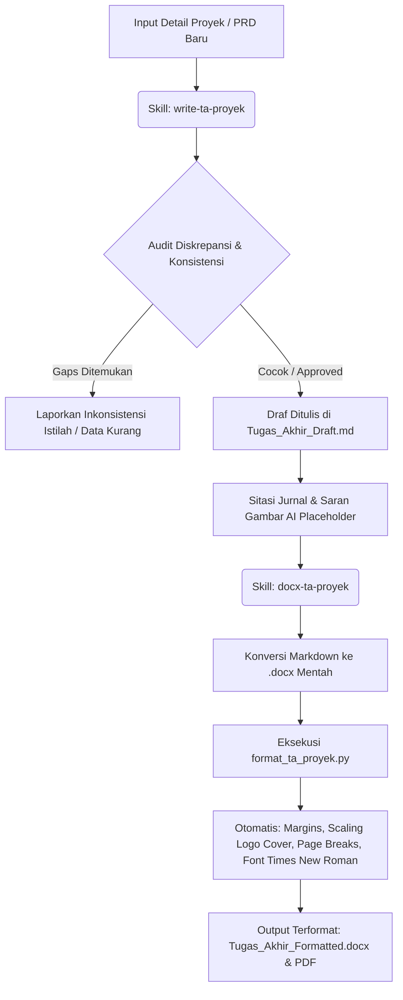

# Panduan Penulisan & Formatting Tugas Akhir Proyek (UPNVJ FIK 2025)

Repository ini berisi dokumen tugas akhir proyek dan otomatisasi formatting sesuai dengan pedoman **Tugas Akhir Skema Proyek Fakultas Ilmu Komputer UPN Veteran Jakarta 2025**.

Untuk memudahkan pengerjaan, proses penulisan dan perapian format dibagi menjadi **dua skill utama**:
1. **`write-ta-proyek`**: Skill untuk memandu dan menghasilkan konten tulisan yang konsisten secara akademik.
2. **`docx-ta-proyek`**: Skill otomatisasi formatting dokumen Word (`.docx`) menggunakan manipulasi XML terstruktur.

---

## Alur Kerja Terintegrasi (Workflow)



---

## 1. Panduan Penulisan (`write-ta-proyek`)

Skill ini digunakan saat menyusun dan merevisi isi laporan bab demi bab secara interaktif.

### Fitur Utama:
*   **Audit Real-Time**: AI mencocokkan input PRD baru Anda dengan draf yang sudah ditulis di `Tugas_Akhir_Draft.md` untuk meminimalkan salah informasi.
*   **Konsistensi Istilah**: Melakukan validasi otomatis terhadap daftar istilah teknis yang tersimpan di `term_registry.json`. Jika dari awal memakai *user interface*, maka penggunaan *antarmuka* akan diperingatkan.
*   **Sitasi Jurnal Otomatis**: 
    1. Mencari dokumen pendukung di folder `journal/` parent directory.
    2. Jika tidak ada, AI mencari jurnal ilmiah asli secara online, memasukkan sitasi ke draf, dan mencatat jurnal tersebut di `citations_to_download.md` agar Anda dapat mengunduhnya nanti.
*   **Saran Visual & Gambar**: Memberikan draf penjelasan teks lengkap dengan placeholder diagram/gambar + tautan referensi visual dari internet serta opsi AI generator.

---

## 2. Otomatisasi Format (`docx-ta-proyek`)

Skill mekanis berbasis Python yang mengoreksi seluruh struktur `.docx` secara instan tanpa merusak konten.

### Aturan Format Otomatis:
*   **Cover Page**: Logo UPNVJ secara otomatis di-scale proporsional menjadi `5.0cm x 3.7cm` dan spasi baris kosong cover disesuaikan agar cover **tepat muat di 1 halaman**.
*   **Pemisahan Halaman (Page Isolation)**: 
    *   `DAFTAR ISI`, `DAFTAR GAMBAR`, dan `DAFTAR TABEL` otomatis memiliki aturan `pageBreakBefore` agar berada di halaman masing-masing secara terpisah.
    *   Seluruh baris kosong yang tidak sengaja terbuat di sela-sela daftar dibersihkan untuk mencegah halaman kosong (blank page).
*   **Restart Halaman**: Halaman awal bab otomatis berganti dari angka Romawi (`i, ii, iii...`) menjadi angka Arab (`1, 2, 3...`) tepat dimulai dari **BAB I PENDAHULUAN**.
*   **Margins**: Mengatur batas kertas standar A4 dengan batas Left = 4cm, Right/Top/Bottom = 3cm.
*   **Typography**: Memaksa semua elemen teks menggunakan **Times New Roman** (Body: 12pt spasi 1.5, Caption: 12pt spasi 1.0, Judul Bab: 14pt Bold Centered).

---

## Cara Menjalankan Pipeline Formatter

1.  **Unpack** berkas `.docx` mentah ke folder xml:
    ```bash
    python skills/scripts/unpack.py Tugas_Akhir.docx unpacked_ta
    ```
2.  **Suntikkan preset penomoran** bab dan heading:
    ```bash
    python skills/scripts/add_numbering_preset.py unpacked_ta
    ```
3.  **Eksekusi script perapian format**:
    ```bash
    python skills/scripts/format_ta_proyek.py unpacked_ta
    ```
4.  **Pack** kembali folder XML menjadi dokumen Word terformat:
    ```bash
    python skills/scripts/pack.py unpacked_ta Tugas_Akhir_Formatted.docx
    ```
5.  **Validasi halaman**: Jalankan script pemeriksa nomor halaman untuk memastikan layout aman:
    ```bash
    python scratch/inspect_page_numbers.py
    ```

---

> [!IMPORTANT]
> **Pembaruan Halaman DAFTAR ISI**: Karena penyesuaian spasi dan margin menggeser posisi teks, buka berkas `Tugas_Akhir_Formatted.docx` di Microsoft Word, klik kanan tabel **DAFTAR ISI**, pilih **"Update Field" -> "Update entire table"** untuk menyinkronkan nomor halaman terbaru.
