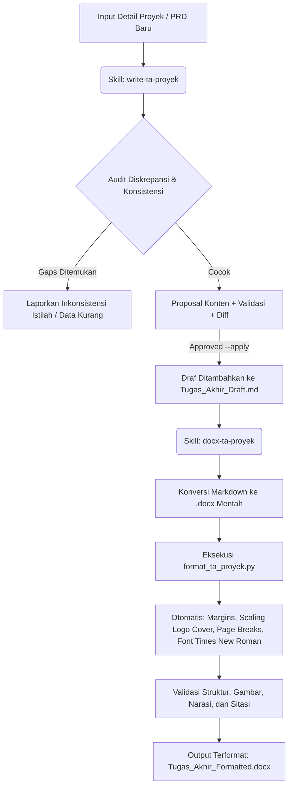

# Panduan Penulisan & Formatting Tugas Akhir Proyek (UPNVJ FIK 2025)

Repository ini berisi dokumen tugas akhir proyek dan otomatisasi formatting sesuai dengan pedoman **Tugas Akhir Skema Proyek Fakultas Ilmu Komputer UPN Veteran Jakarta 2025**.

Dokumentasi lengkap seluruh fitur, aturan penulisan, format kampus, pipeline, validasi, testing, dan troubleshooting tersedia di **[DOKUMENTASI-PIPELINE.md](DOKUMENTASI-PIPELINE.md)**. AI agent sebaiknya mulai dari **[AGENTS.md](AGENTS.md)** agar dapat memilih file yang relevan tanpa memindai seluruh codebase.

Untuk memudahkan pengerjaan, proses penulisan dan perapian format dibagi menjadi **dua skill utama**:
1. **`write-ta-proyek`**: Skill untuk memandu dan menghasilkan konten tulisan yang konsisten secara akademik.
2. **`docx-ta-proyek`**: Skill otomatisasi formatting dokumen Word (`.docx`) menggunakan manipulasi XML terstruktur.

---

## Alur Kerja Terintegrasi (Workflow)


```mermaid
graph TD
    A[Input Detail Proyek / PRD Baru] --> B(Skill: write-ta-proyek)
    B --> C{Audit Diskrepansi & Konsistensi}
    C -->|Gaps Ditemukan| D[Laporkan Inkonsistensi Istilah / Data Kurang]
    C -->|Cocok| E[Proposal Konten + Validasi + Diff]
    E -->|Approved --apply| F[Draf Ditambahkan ke Tugas_Akhir_Draft.md]
    F --> G(Skill: docx-ta-proyek)
    G --> H[Konversi Markdown ke .docx Mentah]
    H --> I[Eksekusi format_ta_proyek.py]
    I --> J[Otomatis: Margins, Scaling Logo Cover, Page Breaks, Font Times New Roman]
    J --> K[Validasi Struktur, Gambar, Narasi, dan Sitasi]
    K --> L[Output Terformat: Tugas_Akhir_Formatted.docx]
```

---

## 1. Panduan Penulisan (`write-ta-proyek`)

Skill ini digunakan saat menyusun dan merevisi isi laporan bab demi bab secara interaktif.

### Fitur Utama:
*   **Audit & Proposal**: AI dapat menerima konteks subbab dan fakta yang dipilih, lalu menghasilkan kandidat JSON yang divalidasi sebelum ditawarkan sebagai diff.
*   **Konsistensi Istilah**: Melakukan validasi otomatis terhadap daftar istilah teknis yang tersimpan di `term_registry.json`. Jika dari awal memakai *user interface*, maka penggunaan *antarmuka* akan diperingatkan.
*   **Guard Sitasi**: Kandidat hanya boleh memakai sitasi yang sudah memiliki entri pada Daftar Pustaka. Pencarian dan verifikasi sumber baru dilakukan sebagai pekerjaan riset terpisah, bukan ditambahkan otomatis oleh generator.
*   **Guard Fakta**: Nilai proyek harus sama persis dengan `project_facts.json`; data yang belum tersedia ditandai `[TBD: ...]`.
*   **Suggest Secara Default**: Generator tidak mengubah `Tugas_Akhir_Draft.md` sampai pengguna meninjau diff dan memberi `--apply` eksplisit.
*   **Gambar Tetap Terkontrol**: Generator teks tidak membuat caption/aset baru dan hanya boleh merujuk Gambar/Tabel yang sudah ada, di tengah kalimat dan pada bab yang sama.

### Generator konten opsional

Untuk membuat paket konteks yang dapat dibaca AI agent lain tanpa mengubah draf:

```powershell
C:\Python312\python.exe skills/scripts/generate_content.py --section 3.2.1 --prepare-out scratch/generation-request.json
```

Validasi kandidat AI dalam mode suggest:

```powershell
C:\Python312\python.exe skills/scripts/generate_content.py --section 3.2.1 --response-file scratch/generation-candidate.json
```

Tambahkan `--apply` hanya setelah proposal dan diff disetujui. Kontrak JSON,
provider HTTP, pemilihan fakta privat, serta seluruh guard dijelaskan di
**[DOKUMENTASI-PIPELINE.md](DOKUMENTASI-PIPELINE.md#generator-konten-ai-opsional)**.

---

## 2. Otomatisasi Format (`docx-ta-proyek`)

Skill mekanis berbasis Python yang mengoreksi seluruh struktur `.docx` secara instan tanpa merusak konten.

### Aturan Format Otomatis:
*   **Cover Page**: Logo UPNVJ secara otomatis di-scale proporsional menjadi `5.0cm x 3.7cm` dan spasi baris kosong cover disesuaikan agar cover **tepat muat di 1 halaman**.
*   **Pemisahan Halaman (Page Isolation)**: 
    *   `DAFTAR ISI`, `DAFTAR GAMBAR`, dan `DAFTAR TABEL` otomatis memiliki aturan `pageBreakBefore` agar berada di halaman masing-masing secara terpisah.
    *   Seluruh baris kosong yang tidak sengaja terbuat di sela-sela daftar dibersihkan untuk mencegah halaman kosong (blank page).
*   **Penomoran Halaman**: Front matter memakai angka Romawi di kanan bawah (sampul tanpa nomor). Angka Arab di-reset menjadi `1` pada **BAB I PENDAHULUAN**; halaman pembuka setiap BAB menampilkan nomor di tengah bawah, sedangkan halaman lanjutannya di kanan atas.
*   **Margins**: Mengatur batas kertas standar A4 dengan batas Left = 4cm, Right/Top/Bottom = 3cm.
*   **Typography**: Memaksa semua elemen teks menggunakan **Times New Roman** (Body: 12pt spasi 1.15, Caption: 12pt spasi 1.0, Judul Bab: 14pt Bold Centered).
*   **Referensi Gambar Exact**: Draf yang sudah dimigrasikan menulis `[FIGURE:<id-manifest>]` tepat sebelum caption. Pipeline mengganti marker dengan aset branch yang ID-nya sama dan menyimpan ID tersebut pada metadata drawing, sehingga caption atau nama file yang mirip tidak tertukar. Fallback caption tetap tersedia untuk draf branch lama.

---

## Konten Bersama Tiga Laporan

Bagian yang harus identik antarlaporan disimpan satu kali di `content/shared/`. Draf setiap branch menyisipkannya dengan directive berikut:

```md
<!-- PIPELINE:INCLUDE content/shared/testing/uat.md -->
```

Pipeline memperluas include di memori sebelum Markdown diubah menjadi DOCX. Judul, identitas, fokus masalah, implementasi, dan kesimpulan kontribusi tetap berada di branch masing-masing. Kontrak lengkap untuk manusia dan AI agent tersedia di **[content/README.md](content/README.md)**.

Validasi include tanpa membuat DOCX:

```powershell
C:\Python312\python.exe skills/scripts/merge_draft_to_docx.py --check-includes
```

---

## Cara Menjalankan Pipeline Formatter

1.  **Unpack** berkas `.docx` mentah ke folder xml:
    ```bash
    python skills/scripts/unpack.py Tugas_Akhir.docx unpacked_ta
    ```
2.  **Suntikkan preset penomoran** bab dan heading:
    ```bash
    python skills/scripts/add_numbering_preset.py unpacked_ta
    ```
3.  **Eksekusi script perapian format**:
    ```bash
    python skills/scripts/format_ta_proyek.py unpacked_ta
    ```
4.  **Pack** kembali folder XML menjadi dokumen Word terformat:
    ```bash
    python skills/scripts/pack.py unpacked_ta Tugas_Akhir_Formatted.docx
    ```
5.  **Validasi halaman**: Jalankan script pemeriksa nomor halaman untuk memastikan layout aman:
    ```bash
    python scratch/inspect_page_numbers.py
    ```

---

> [!IMPORTANT]
> **Pembaruan Halaman DAFTAR ISI**: Karena penyesuaian spasi dan margin menggeser posisi teks, buka berkas `Tugas_Akhir_Formatted.docx` di Microsoft Word, klik kanan tabel **DAFTAR ISI**, pilih **"Update Field" -> "Update entire table"** untuk menyinkronkan nomor halaman terbaru.
