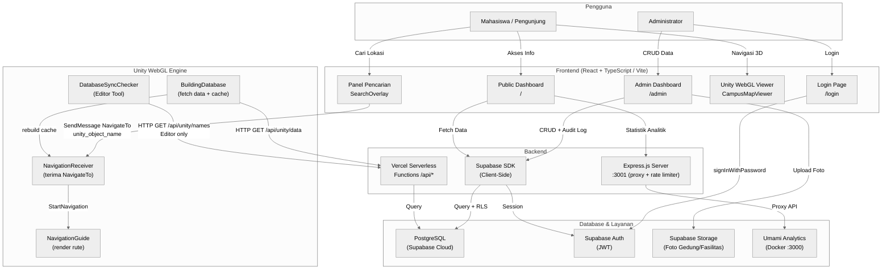
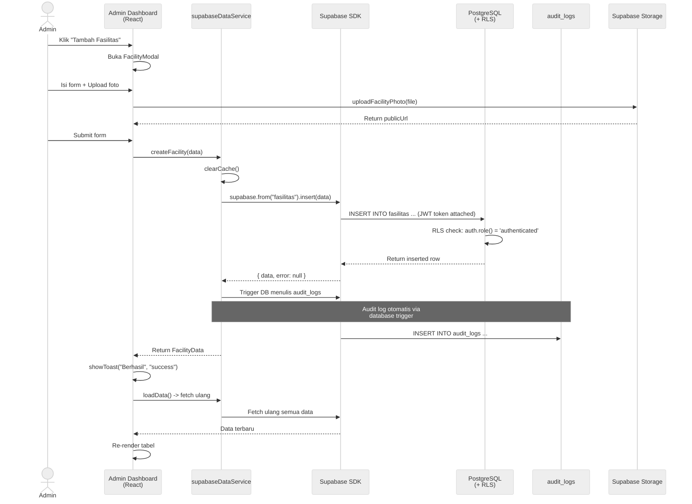
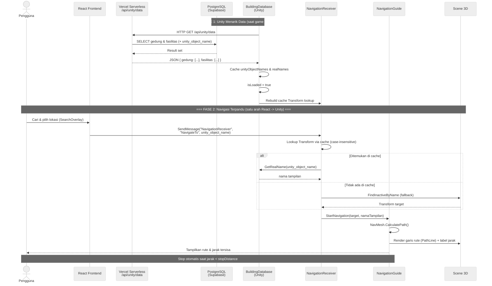
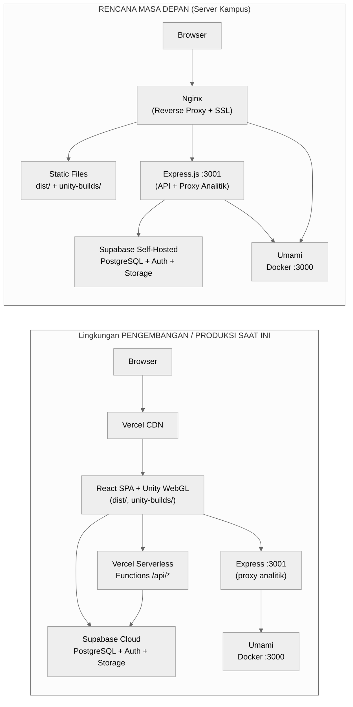
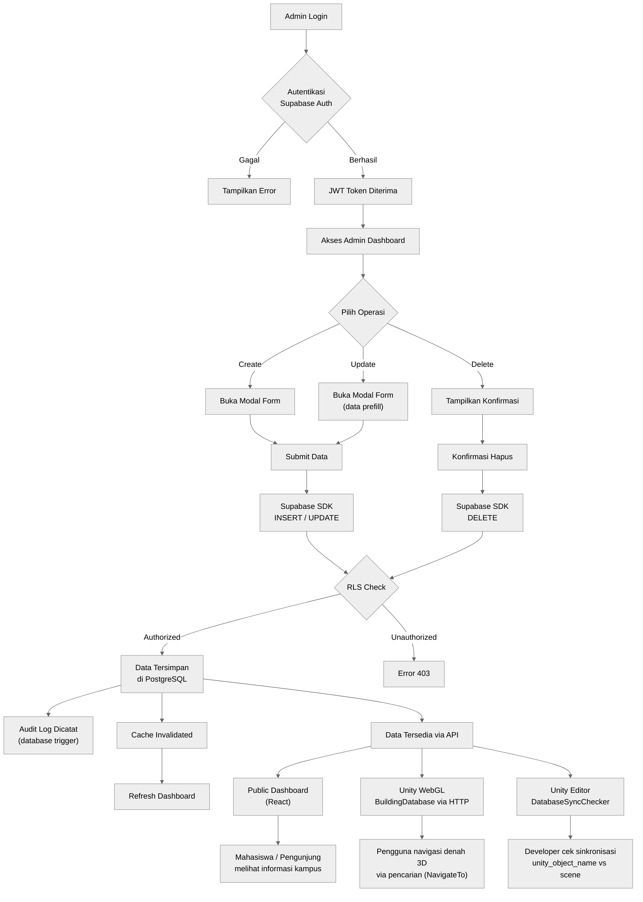

# Diagram Alur Implementasi Sistem

> **Cara pakai**: Copy kode Mermaid ke [mermaid.live](https://mermaid.live) → Export sebagai PNG/SVG → Masukkan ke dokumen Word.
>
> **Versi:** Disesuaikan dengan PRD terkini. Modul lama (`BuildingDataReceiver`, `BuildingClickHandler`, `ReceiveBuildingsData`, callback Unity→React) sudah **deprecated** dan digantikan alur baru: Unity menarik data sendiri via `GET /api/unity/data`, dan komunikasi bersifat **satu arah** React→Unity (`SendMessage("NavigationReceiver","NavigateTo", unity_object_name)`).

---

## 1. Diagram Arsitektur Sistem (Keseluruhan)



---

## 2. Sequence Diagram — Alur CRUD Admin (Create Fasilitas)



---

## 3. Sequence Diagram — Alur Data & Navigasi Unity WebGL



---

## 4. Diagram Deployment — Pengembangan vs Produksi



> Catatan: saat ini sistem berjalan di **Supabase Cloud** agar online 24/7. **Supabase self-hosted** adalah rencana masa depan saat server kampus tersedia. `docker-compose.yml` di repo web khusus untuk **Umami Analytics**, bukan Supabase.

---

## 5. Diagram Alur Sistem End-to-End (Flowchart)



---

## Cara Export untuk Dokumen Word

1. Buka **[mermaid.live](https://mermaid.live)**
2. Copy-paste kode Mermaid (tanpa backtick ` ```mermaid `)
3. Diagram akan ter-render otomatis di panel kanan
4. Klik **Actions → Export PNG** (resolusi tinggi) atau **SVG**
5. Masukkan ke dokumen Word sebagai gambar

> Tema `neutral` sudah disetel via `%%{init: {'theme':'neutral'}}%%` di awal tiap diagram agar warna konsisten dan netral. Versi PlantUML (`.puml`) dari diagram-diagram BAB II tersedia di `document/diagrams/`.
