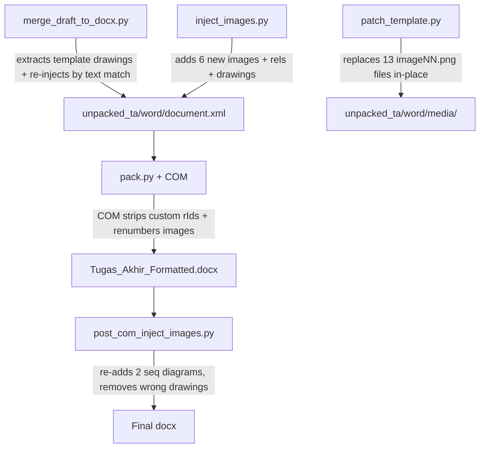
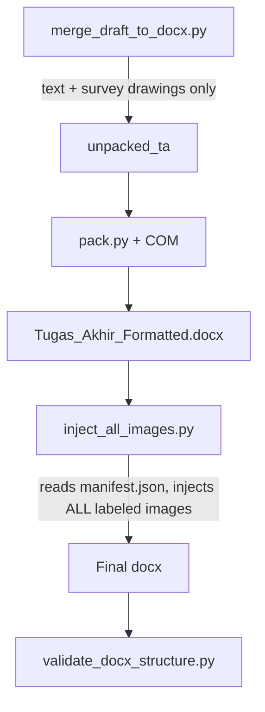

# Long-Term Image Pipeline Overhaul

## Problem Summary

Image injection scattered across 4 scripts. No labeling. Word COM strips custom images forcing workarounds. `imageNN.png` names meaningless.

## Current State (Broken)



**Problems:**
1. 4 scripts touch images → impossible to debug
2. `imageNN.png` names → no one knows what's inside
3. Word COM strips custom rIds → need post-COM workaround
4. Duplicate images (image18 = image35 = seq_auth)
5. Page split still possible for large images despite keepNext

---

## Proposed Solution

### Phase 1: Create labeled image folder + manifest

Create `images/` folder with human-readable names:

```
images/
├── manifest.json          # Single source of truth
├── survey_01_profil.png
├── survey_02_efektivitas.png
├── survey_03_frekuensi.png
├── survey_04_perilaku.png
├── survey_05_urgensi.png
├── survey_06_adopsi.png
├── survey_07_prioritas.png
├── cover_upn_logo.jpg
├── cover_lambang.jpg
├── diagram_arsitektur.png
├── diagram_tahap_pengembangan.jpg
├── diagram_erd.png
├── diagram_use_case_legenda.png
├── diagram_use_case.jpg
├── diagram_activity_kelola_data.png
├── diagram_activity_integrasi.png
├── diagram_sequence_autentikasi.png
├── diagram_sequence_sinkronisasi.png
├── mockup_login_admin.png
├── mockup_dashboard_admin.png
├── mockup_modal_tambah_gedung.png
├── mockup_modal_edit_gedung.png
├── mockup_modal_hapus_gedung.png
├── mockup_admin_traffic.png
├── mockup_hero_section.png
├── mockup_public_traffic.png
├── mockup_fasilitas_aset.png
├── mockup_modal_list_fasilitas.png
├── mockup_modal_fasilitas_aset.png
├── mockup_footer.png
├── foto_pakta_integritas.jpg
├── foto_wawancara_warek.jpg
├── impl_pointer_hierarchy.png
└── impl_sync_db_checker.png
```

#### [NEW] `images/manifest.json`
```json
{
  "images": [
    {
      "id": "survey_01",
      "file": "survey_01_profil.png",
      "caption": "Gambar 2.1 Hasil Kuesioner: Profil Status Akademik",
      "source": "template",
      "chapter": 2,
      "inject_method": "template_drawing"
    },
    {
      "id": "seq_auth",
      "file": "diagram_sequence_autentikasi.png",
      "caption_match": "Sequence Diagram: Autentikasi",
      "source": "dokumentasi/sequence_autentikasi.png",
      "chapter": 2,
      "inject_method": "post_com",
      "cx": 4572000,
      "cy": 2945876
    }
  ]
}
```

> [!IMPORTANT]
> Manifest = single source of truth. No more hardcoded paths/rIds in scripts.

---

### Phase 2: Consolidate to single post-COM injector

#### [DELETE] Image injection from `inject_images.py`
Remove: file copies, relationship additions, drawing XML injection for ALL 6 images.
Keep: only the interview text injection logic (if any).

#### [DELETE] Image replacement from `patch_template.py`  
Remove: the `shutil.copy2` block (lines 423-449).
Keep: XML text patching logic.

#### [MODIFY] `merge_draft_to_docx.py`
Change: Don't inject template drawings for images that will be handled by post-COM.
Keep: Survey chart drawings (from template, these work fine).

#### [NEW] `scratch/inject_all_images.py` (replaces `post_com_inject_images.py`)
Single script that:
1. Reads `images/manifest.json`
2. For each image in manifest:
   - Copies labeled file to `word/media/imageNN.png` 
   - Adds relationship `rIdNN`
   - Finds caption paragraph by `caption_match`
   - Removes any wrong preceding drawing
   - Inserts correct drawing with keepNext+keepLines+keepWithNext
3. Runs AFTER COM (post-COM approach proven reliable)



---

### Phase 3: Stricter page split prevention

Current `keepNext` + `keepLines` on drawing paragraph → Word SHOULD keep drawing+caption together. But Word can still split if:
- Image is very tall (>50% page height)
- Previous paragraph forces page break

#### Fix: Add `w:keepNext` to caption paragraphs too
Chain: `drawing(keepNext+keepLines)` → `caption(keepNext)` → ensures drawing+caption+following text all stay together.

#### Fix: Add `w:pageBreakBefore` for large images
If image height > 60% page height (>~15.2cm = 5486400 EMU), insert page break before drawing. Better to start new page than split.

#### Fix: Validate in `validate_docx_structure.py`
Add check I: every `Gambar` caption's preceding drawing MUST have keepNext+keepLines.
Add check J: caption paragraph itself MUST have keepLines.

---

## Pipeline Order (After Refactor)

| Step | Script | What |
|------|--------|------|
| 1 | `unpack.py` | Unpack template |
| 2 | `merge_draft_to_docx.py` | Merge draft text + survey drawings |
| 3 | `patch_template.py` | Patch text only (no image copies) |
| 4 | `inject_warek2_xml.py` | Interview text |
| 5 | `add_numbering_preset.py` | Numbering |
| 6 | `format_ta_proyek.py` | Formatting + keepNext on template drawings |
| 7 | `pack.py` + COM | Pack + field update |
| 8 | **`inject_all_images.py`** | ALL images from manifest (post-COM) |
| 9 | `validate_docx_structure.py` | Structural validation |

## Open Questions

> [!IMPORTANT]  
> 1. Should survey chart images (Gambar 2.1-2.7) also move to post-COM injection? They currently work fine via template drawing extraction. Moving them would simplify pipeline but increase post-COM work.
> 2. Some images are from template (UML diagrams) with no source in `dokumentasi/`. Should we extract them from template and save to `images/` as baseline?
> 3. `header+gedung-view.png` (201KB) doesn't match image22 (189KB) in final docx — Word recompressed. Should we pre-compress images to avoid Word's lossy recompression?

## Verification Plan

### Automated
- `validate_docx_structure.py` extended with checks I+J
- Image manifest validator (every manifest entry has file, every file has manifest entry)
- MD5 verification: image in docx matches source file

### Manual
- Open in Word, check each figure caption matches its image
- Print preview: verify no image-caption page splits
